# 아키텍처 문서

**프로젝트**: youngs75-coding-ai-agent
**패키지**: youngs75_a2a
**버전**: 0.1.0

---

## 1. 시스템 전체 구성도

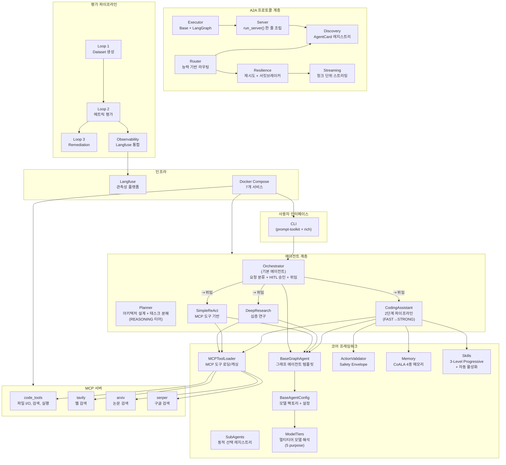

---

## 2. 요청 흐름 (Orchestrator-First 아키텍처)

모든 사용자 요청은 Orchestrator를 거쳐 적합한 Subagent로 라우팅됩니다.

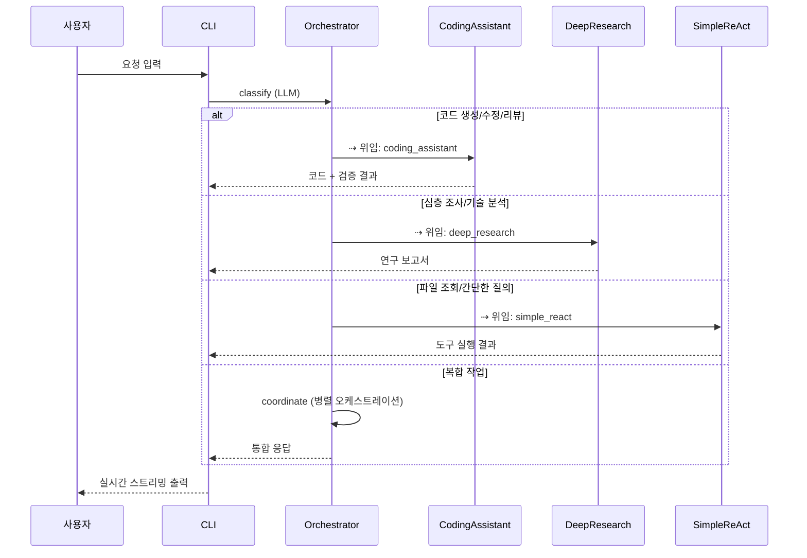

---

## 3. 3계층 분리 아키텍처

본 프레임워크는 **관심사 분리** 원칙에 따라 3개 계층으로 구성된다.

| 계층 | 디렉토리 | 역할 | 의존 방향 |
|------|----------|------|-----------|
| **Core** | `core/` | 도메인 무관 프레임워크 | 없음 (최하위) |
| **A2A** | `a2a_local/` | 프로토콜 통합 | Core |
| **Agents** | `agents/` | 도메인별 에이전트 구현 | Core, A2A |

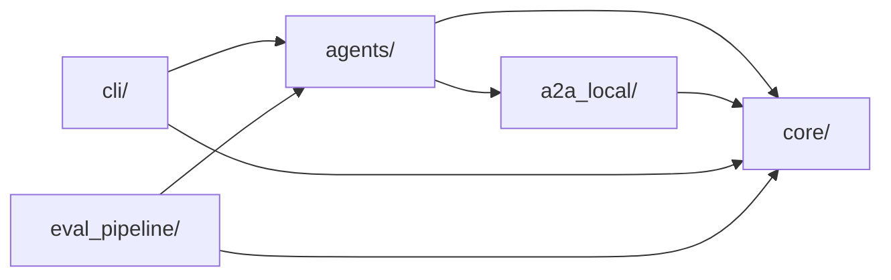

새 에이전트를 추가할 때 `agents/` 디렉토리에 구현하면 `core/`와 `a2a_local/` 인프라를 그대로 재사용할 수 있다.

---

## 4. 에이전트별 그래프 흐름도

### 4.1 CodingAssistantAgent (2단계 파이프라인)

논문 인사이트 기반 설계:
- **P1** (Agent-as-a-Judge): parse → execute → verify 최소 3단계
- **P2** (RubricRewards): Generator/Verifier 모델 분리 + 도구 호출/코드 생성 모델 분리
- **P5** (GAM): MCP 도구를 통한 JIT 원본 참조

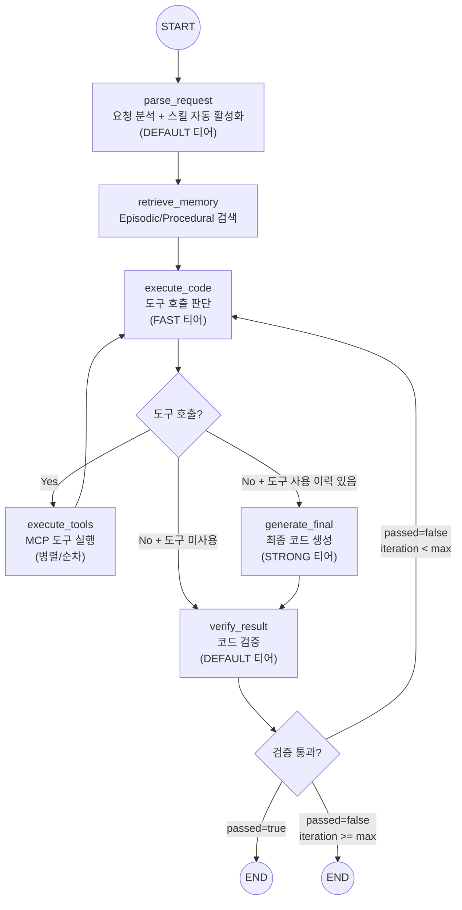

**2단계 파이프라인 라우팅 로직:**
- 도구 호출 있음 → `EXECUTE_TOOLS` → `EXECUTE` (ReAct 루프, FAST 모델)
- 도구 호출 없음 + 이전에 도구 사용함 → `GENERATE_FINAL` (STRONG 모델로 최종 생성)
- 도구 호출 없음 + 도구 미사용 → `VERIFY` (FAST 출력 그대로 검증, STRONG 생략)

**비용 최적화**: 단순 코드 생성(도구 불필요)은 FAST 모델만 사용하여 비용 90% 절감.

**목적별 모델 매핑:**
| purpose | tier | 노드 |
|---------|------|------|
| `parsing` | FAST | parse_request |
| `tool_planning` | FAST | execute_code (ReAct 루프) |
| `generation` | STRONG | generate_final |
| `verification` | DEFAULT | verify_result |

**상태 스키마**: `CodingState`
- `messages`: 대화 이력 (add_messages 누적)
- `semantic_context`: Semantic Memory (프로젝트 규칙/컨벤션)
- `skill_context`: Skills 본문 (L2, 자동 활성화된 스킬)
- `episodic_log`: Episodic Memory (이전 실행 이력)
- `procedural_skills`: Procedural Memory (학습된 코드 패턴)
- `parse_result`: 요청 분석 결과 (task_type, language, description 등)
- `generated_code`: 생성된 코드
- `verify_result`: 검증 결과 (`passed`, `issues`, `suggestions`)
- `project_context`: JIT 원본 참조 결과
- `iteration` / `max_iterations`: 반복 제어
- `tool_call_count`: ReAct 루프 내 도구 호출 누적 횟수

### 4.2 OrchestratorAgent (기본 에이전트)

모든 사용자 요청의 진입점. 요청을 분류하여 적합한 Subagent에 위임.

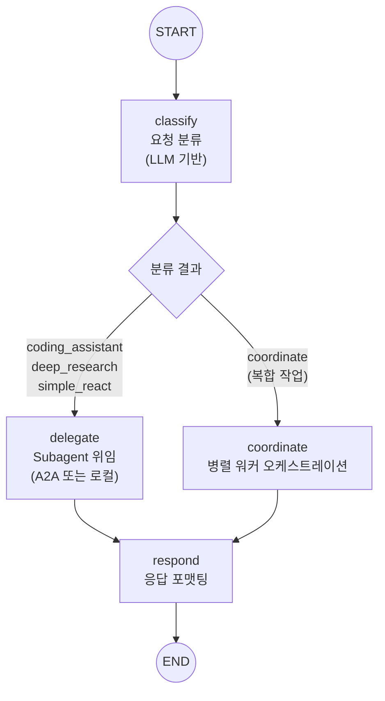

**위임 전략 (우선순위):**
1. A2A 프로토콜 (HTTP 엔드포인트가 설정된 경우)
2. 로컬 에이전트 직접 호출 (폴백)

**등록된 Subagent:**
| 에이전트 | 설명 |
|----------|------|
| `coding_assistant` | 코드 생성, 수정, 리팩토링, 버그 수정, 코드 리뷰 |
| `deep_research` | 심층 조사, 리서치, 기술 분석, 보고서 작성 |
| `simple_react` | MCP 도구를 사용한 간단한 질의응답, 파일 조회 |

### 4.3 DeepResearchAgent

다단계 심층 연구 워크플로우.

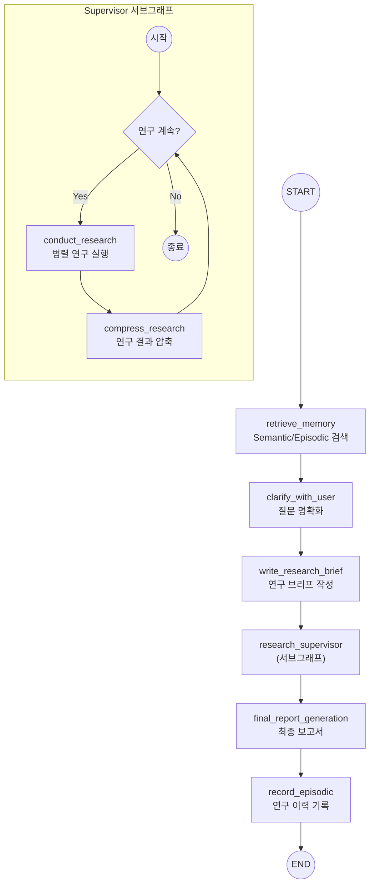

### 4.4 SimpleMCPReActAgent

LangGraph `create_react_agent` 기반 단일 노드 에이전트.

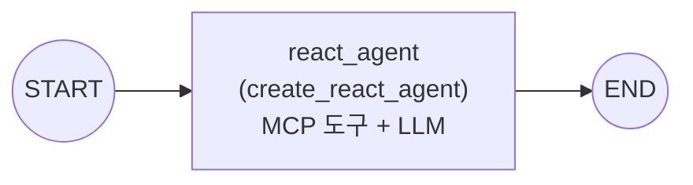

---

## 5. 코어 프레임워크 구조

### 5.1 BaseGraphAgent (Template Method 패턴)

모든 에이전트의 기반 클래스. 서브클래스는 `init_nodes()`와 `init_edges()`만 구현하면 된다.

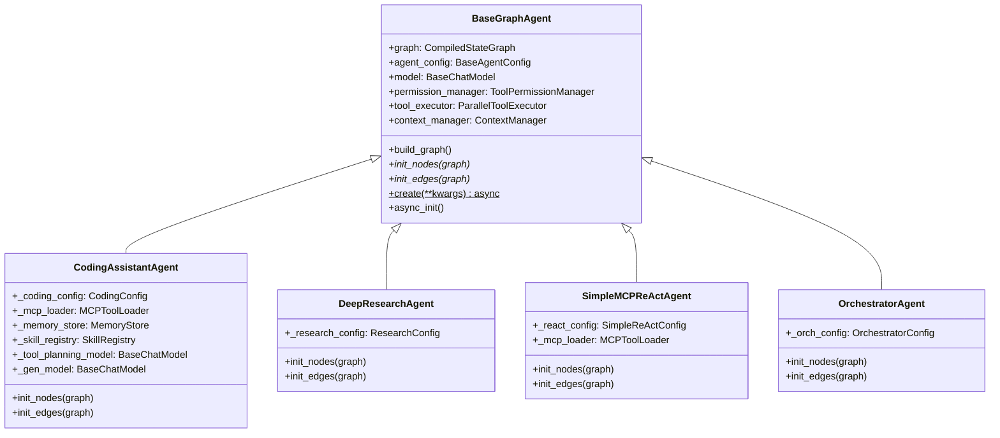

### 5.2 BaseAgentConfig (모델 해석 체계)

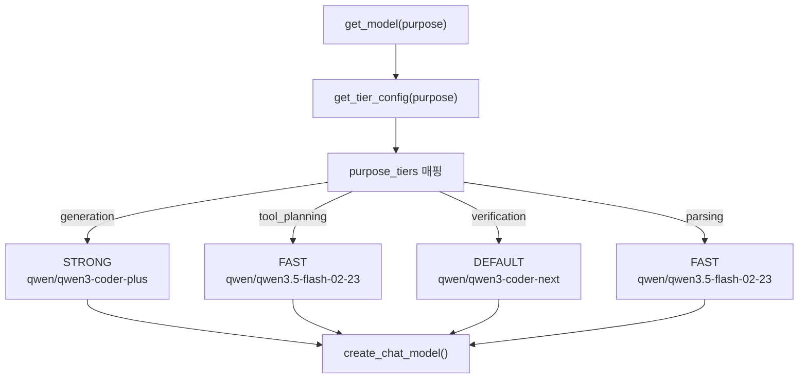

CodingConfig는 환경변수(`CODING_GEN_MODEL` 등)가 있으면 티어보다 우선 적용한다.

### 5.3 메모리 시스템 (CoALA 논문 기반)

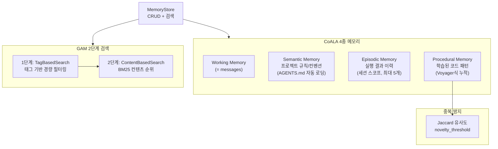

### 5.4 Skills 시스템 (3-Level Progressive Loading + 자동 활성화)

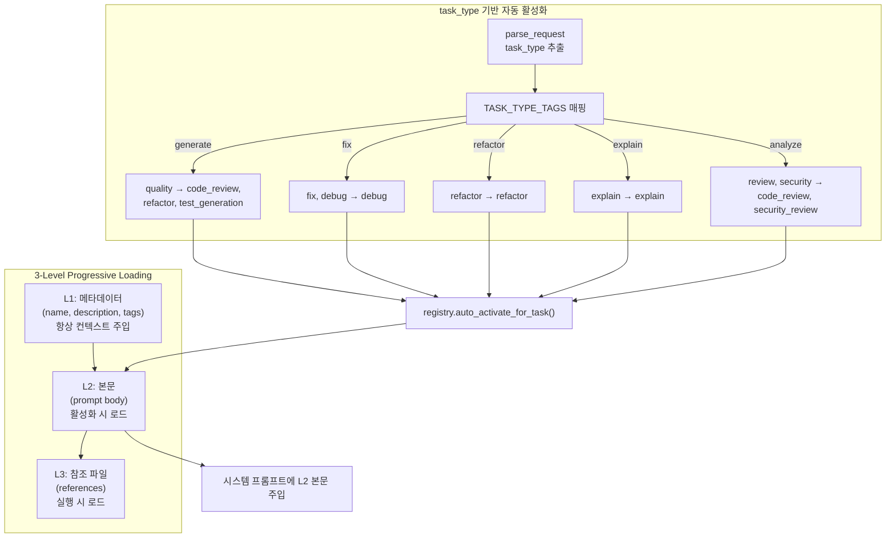

- `SkillLoader`: YAML/JSON 파일에서 스킬 로드
- `SkillRegistry`: 스킬 등록, 검색, 활성화 관리 + `auto_activate_for_task()`
- 수동 활성화: `/skill activate <name>`

### 5.5 SubAgent 동적 선택 (Puppeteer 논문 기반)

```
R = r(quality) - lambda * C(cost)

quality: 에이전트의 태스크 유형별 성공률 (70%) + 전체 성공률 (30%)
cost:    에이전트의 cost_weight (레이턴시 + 토큰 비용 대리)
lambda:  비용 민감도 (환경변수로 조정)
```

`SubAgentRegistry`가 사용 통계를 추적하여 선택 품질을 지속적으로 개선한다.

### 5.6 ActionValidator (Safety Envelope)

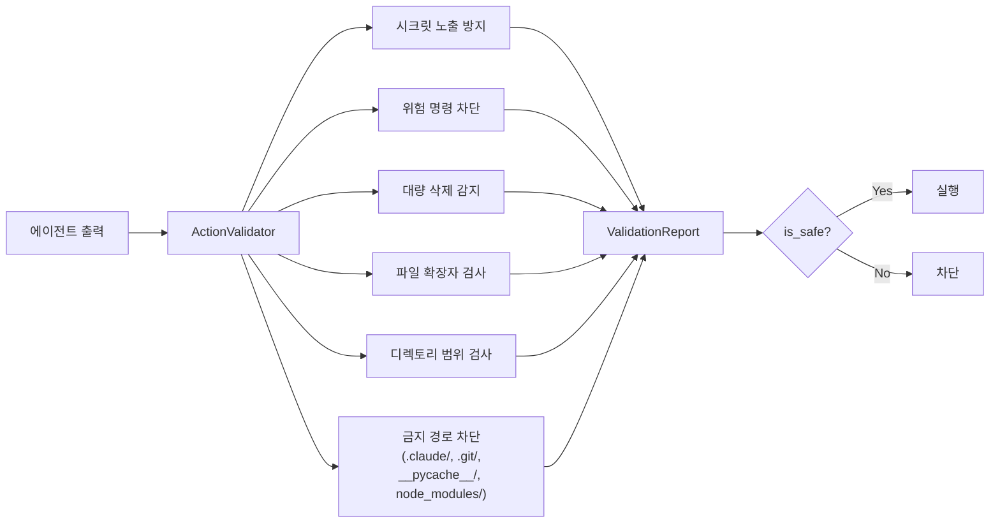

---

## 6. A2A 프로토콜 통합

### 6.1 서버 조립 흐름

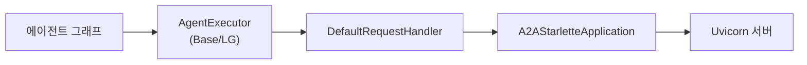

`run_server()` 한 줄로 에이전트를 A2A 서버로 노출:

```python
run_server(
    executor=LGAgentExecutor(graph=agent.graph),
    name="coding-agent",
    port=8080,
)
```

### 6.2 복원력 패턴

- **RetryPolicy**: 지수 백오프 (base_delay * 2^attempt, max_delay=30s)
- **CircuitBreaker**: 연속 5회 실패 시 OPEN, 30초 후 HALF_OPEN
- **AgentMonitor**: 에이전트별 성공률, 응답 시간, 서킷 상태 추적
- **ResilientA2AClient**: 위 패턴을 통합한 복원력 내장 클라이언트

### 6.3 라우팅 전략

`AgentRouter`는 4가지 라우팅 모드를 지원한다:

| 모드 | 전략 |
|------|------|
| `SKILL_BASED` | 스킬 매칭 점수 + 성공률 종합 평가 (기본) |
| `ROUND_ROBIN` | 순차적 분배 |
| `LEAST_LOADED` | 최소 부하 에이전트 선택 |
| `WEIGHTED` | 성공률 (70%) + 응답시간 역수 (30%) |

---

## 7. CLI 실행 흐름

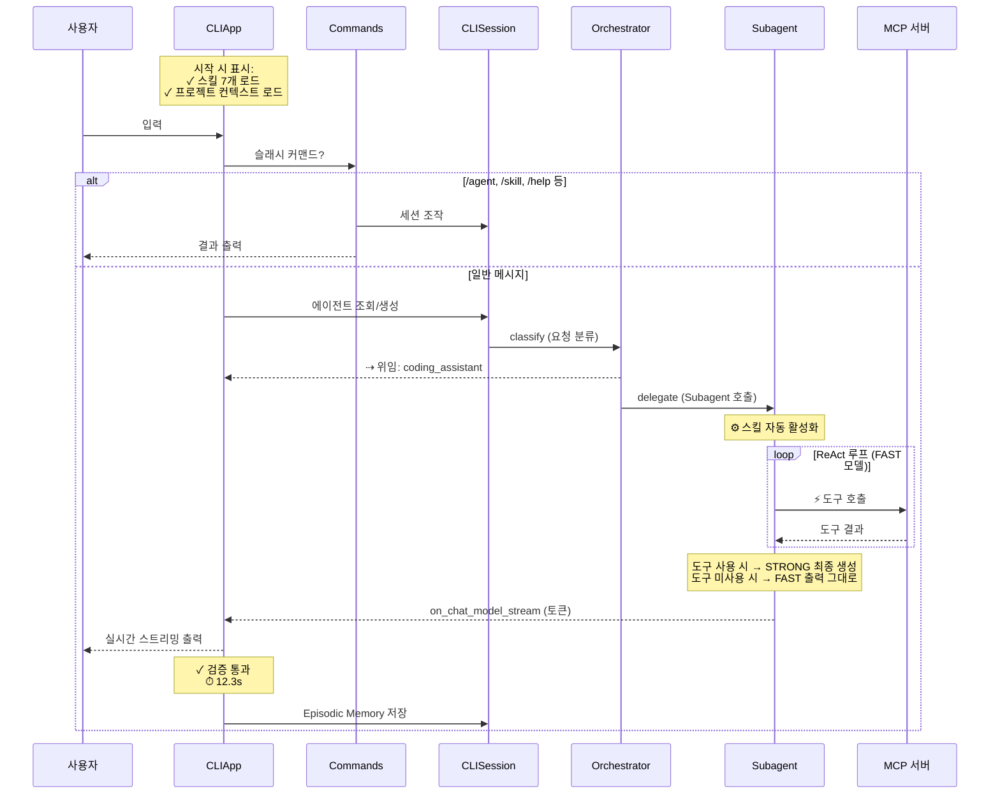

### CLI UX 피드백

| 시점 | 표시 | 의미 |
|------|------|------|
| 시작 | `✓ 스킬 7개 로드: ...` | 사용 가능한 스킬 목록 |
| parse 후 | `⚙ 스킬 활성화: debug` | task_type 기반 자동 스킬 선택 |
| 도구 호출 | `⚡ read_file pyproject.toml` | MCP 도구 실행 |
| 스피너 | `⠋ 도구 호출 판단 (FAST)` | FAST 모델 ReAct 루프 |
| 스피너 | `⠋ 코드 생성 (STRONG)` | STRONG 모델 최종 생성 |
| Orchestrator | `⇢ 위임: coding_assistant` | Subagent 위임 |
| 검증 | `✓ 검증 통과` / `✗ 검증 실패` | 코드 품질 검증 |
| 종료 | `⏱ 12.3s` | 턴 소요시간 |

---

## 8. 평가 파이프라인 (Closed-Loop)

```mermaid
graph LR
    subgraph Loop1["Loop 1: Dataset"]
        SYN["Synthesizer<br/>합성 데이터 생성"]
        GOL["GoldenBuilder<br/>골든 데이터셋"]
        AUG["FeedbackAugmenter<br/>피드백 증강"]
        CSV["CSV Export/Import"]
    end

    subgraph Loop2["Loop 2: Evaluation"]
        MET["MetricsRegistry<br/>RAG(4) + Agent(2) + Custom(7)"]
        BAT["BatchEvaluator<br/>오프라인/온라인 평가"]
        LFB["LangfuseBridge<br/>트레이스 fetch/push"]
        CAL["CalibrationCases<br/>교정 데이터"]
    end

    subgraph Loop3["Loop 3: Remediation"]
        ANA["분석 (Analyzer)"]
        OPT["최적화 (Optimizer)"]
        REC["추천 (Recommender)"]
        REP["RecommendationReport"]
    end

    Loop1 -->|Golden Dataset| Loop2
    Loop2 -->|평가 결과| Loop3
    Loop3 -->|프롬프트 개선| Loop1

    BAT --> LFB
    LFB --> LF["Langfuse Dashboard"]
    ANA --> OPT --> REC --> REP
    REP -->|get_prompt_changes()| PROMPT["PromptRegistry<br/>프롬프트 버전 관리"]
```

---

## 9. Docker 배포 구성

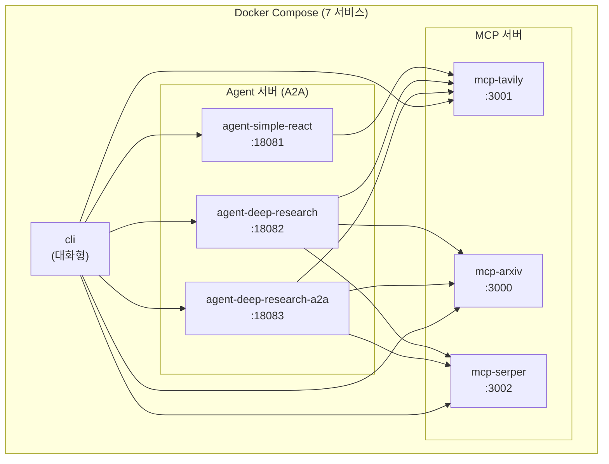

---

## 10. 설계 원칙 (논문 7편 기반)

| 원칙 | 근거 논문 | 적용 |
|------|-----------|------|
| **최소 구조** | Agent-as-a-Judge | parse → execute → verify 3단계 |
| **Generator-Verifier 분리** | RubricRewards | 생성(STRONG)/검증(DEFAULT) 모델 분리 |
| **2단계 파이프라인** | 비용 최적화 | 도구 호출(FAST)/최종 생성(STRONG) 분리 |
| **Safety Envelope** | AutoHarness | ActionValidator + 금지 경로 차단 |
| **CoALA 메모리** | CoALA + Voyager | 4종 메모리 + Semantic 자동 로딩 |
| **JIT 원본 참조** | GAM | MCP 도구로 프로젝트 컨텍스트 직접 읽기 |
| **동적 오케스트레이션** | Puppeteer | Orchestrator-First + SubAgent 위임 |
| **스킬 자동 활성화** | Claude Code 패턴 | task_type → 스킬 태그 매핑 |

---

## 11. 핵심 설계 패턴

| 패턴 | 적용 위치 |
|------|-----------|
| **Template Method** | `BaseGraphAgent.init_nodes()` / `init_edges()` |
| **Factory Method** | `BaseGraphAgent.create()`, `BaseAgentConfig.get_model()` |
| **Adapter** | `LGAgentExecutor` (LangGraph ↔ A2A 프로토콜 브릿지) |
| **Orchestrator-First** | 모든 요청이 Orchestrator → Subagent 라우팅 |
| **2-Stage Pipeline** | FAST(도구 판단) → STRONG(최종 생성) 모델 분리 |
| **Progressive Loading** | Skills 3-Level (L1 메타데이터 → L2 본문 → L3 참조) |
| **Circuit Breaker** | `CircuitBreaker` (CLOSED → OPEN → HALF_OPEN 상태 전이) |
| **Subgraph Composition** | Supervisor → Researcher 서브그래프 중첩 |
| **Override Reducer** | 상태 누적/덮어쓰기 양립 |
