# 아키텍처 문서

**프로젝트**: youngs75-coding-ai-agent  
**패키지**: youngs75_a2a  
**버전**: 0.1.0

---

## 1. 시스템 전체 구성도

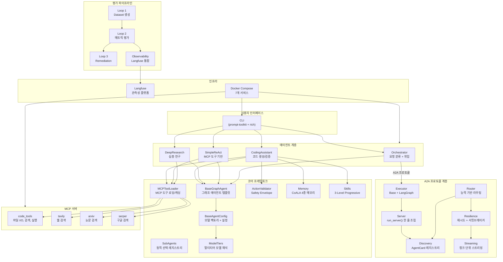

---

## 2. 3계층 분리 아키텍처

본 프레임워크는 **관심사 분리** 원칙에 따라 3개 계층으로 구성된다.

| 계층 | 디렉토리 | 역할 | 의존 방향 |
|------|----------|------|-----------|
| **Core** | `core/` | 도메인 무관 프레임워크 | 없음 (최하위) |
| **A2A** | `a2a_local/` | 프로토콜 통합 | Core |
| **Agents** | `agents/` | 도메인별 에이전트 구현 | Core, A2A |

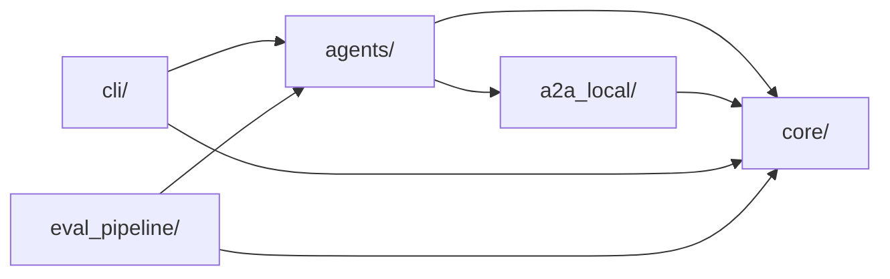

새 에이전트를 추가할 때 `agents/` 디렉토리에 구현하면 `core/`와 `a2a_local/` 인프라를 그대로 재사용할 수 있다.

---

## 3. 에이전트별 그래프 흐름도

### 3.1 CodingAssistantAgent

논문 인사이트 기반 설계:
- **P1** (Agent-as-a-Judge): parse -> execute -> verify 최소 3단계
- **P2** (RubricRewards): Generator/Verifier 모델 분리
- **P5** (GAM): MCP 도구를 통한 JIT 원본 참조

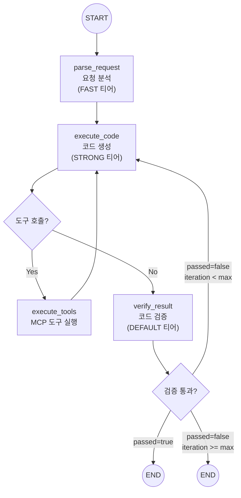

**상태 스키마**: `CodingState`
- `messages`: 대화 이력 (add_messages 누적)
- `semantic_context`: Semantic Memory (프로젝트 규칙/컨벤션)
- `skill_context`: Skills 메타데이터 (L1)
- `episodic_log`: Episodic Memory (이전 실행 이력)
- `procedural_skills`: Procedural Memory (학습된 코드 패턴)
- `parse_result`: 요청 분석 결과
- `generated_code`: 생성된 코드
- `verify_result`: 검증 결과 (`passed`, `issues`, `suggestions`)
- `project_context`: JIT 원본 참조 결과
- `iteration` / `max_iterations`: 반복 제어

### 3.2 DeepResearchAgent

다단계 심층 연구 워크플로우.

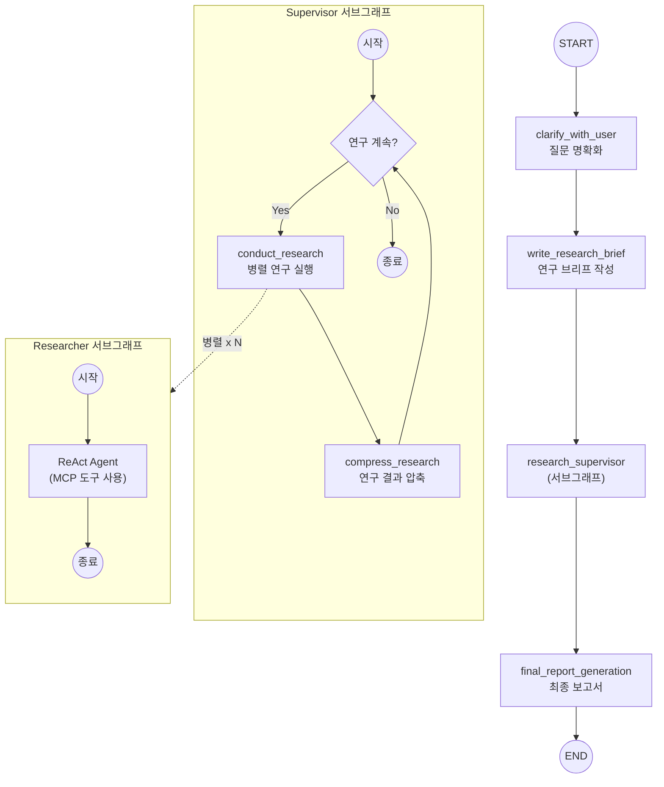

**모델 분리** (ResearchConfig):
- `research_model`: 연구 수행 (기본: gpt-5.4)
- `compression_model`: 연구 결과 압축 (기본: gpt-4o-2024-11-20)
- `final_report_model`: 최종 보고서 (기본: gpt-5.4)

### 3.3 SimpleMCPReActAgent

LangGraph `create_react_agent` 기반 단일 노드 에이전트.

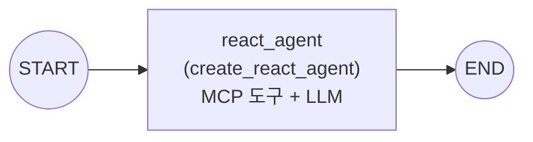

### 3.4 OrchestratorAgent

요청을 분류하여 적합한 하위 에이전트에 A2A 프로토콜로 위임.

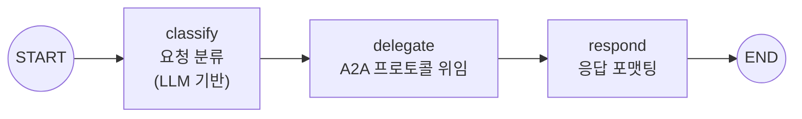

---

## 4. 코어 프레임워크 구조

### 4.1 BaseGraphAgent (Template Method 패턴)

모든 에이전트의 기반 클래스. 서브클래스는 `init_nodes()`와 `init_edges()`만 구현하면 된다.

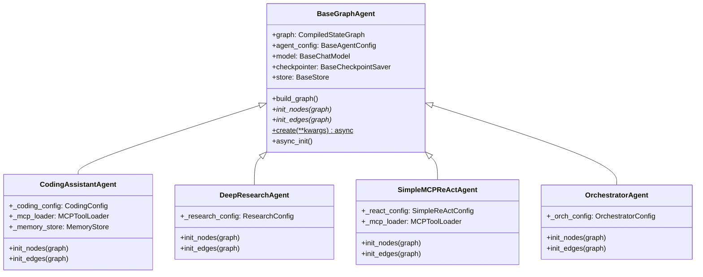

### 4.2 BaseAgentConfig (모델 해석 체계)

두 가지 모델 해석 경로를 제공한다:

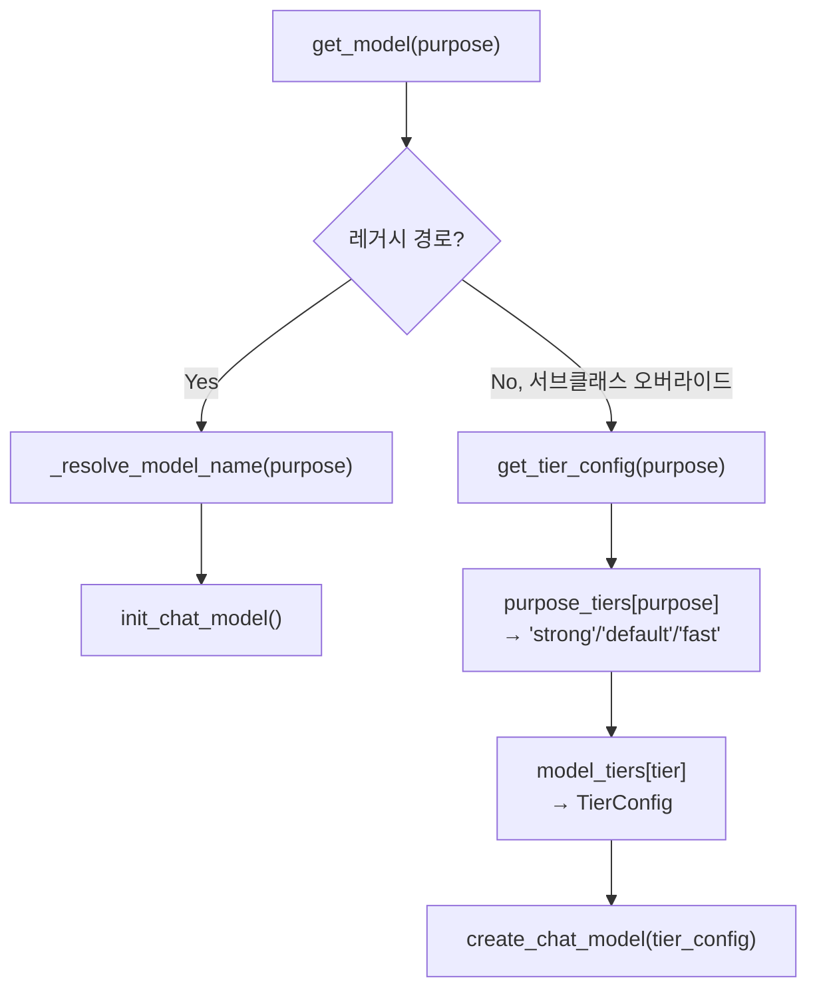

- **레거시 경로**: `_resolve_model_name(purpose)` + `model_provider` -> `init_chat_model()`
- **티어 경로**: `purpose_tiers[purpose]` -> `model_tiers[tier]` -> `create_chat_model()`

CodingConfig는 티어 경로를 사용하되, 환경변수(`CODING_GEN_MODEL` 등)가 있으면 우선 적용한다.

### 4.3 메모리 시스템 (CoALA 논문 기반)

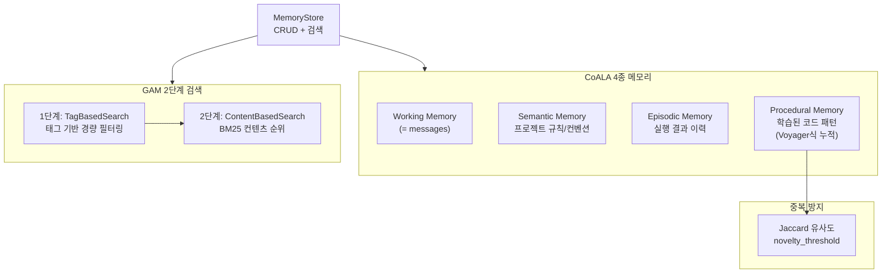

| 메모리 타입 | 저장 내용 | 활성 상태 |
|-------------|-----------|-----------|
| Working | 현재 대화 (`messages`) | 항상 활성 |
| Semantic | 프로젝트 규칙/컨벤션 | 항상 활성 |
| Episodic | 실행 결과 이력 (세션 스코프) | 활성 (최대 5개, 200자 제한) |
| Procedural | 학습된 코드 패턴 | 활성 (검증 통과 시 자동 누적) |

### 4.4 Skills 시스템 (3-Level Progressive Loading)

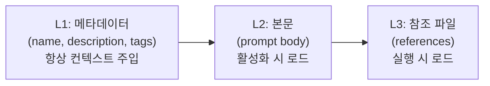

- `SkillLoader`: YAML/JSON 파일에서 스킬 로드
- `SkillRegistry`: 스킬 등록, 검색, 활성화 관리

### 4.5 SubAgent 동적 선택 (Puppeteer 논문 기반)

```
R = r(quality) - lambda * C(cost)

quality: 에이전트의 태스크 유형별 성공률 (70%) + 전체 성공률 (30%)
cost:    에이전트의 cost_weight (레이턴시 + 토큰 비용 대리)
lambda:  비용 민감도 (환경변수로 조정)
```

`SubAgentRegistry`가 사용 통계를 추적하여 선택 품질을 지속적으로 개선한다.

### 4.6 ActionValidator (Safety Envelope)

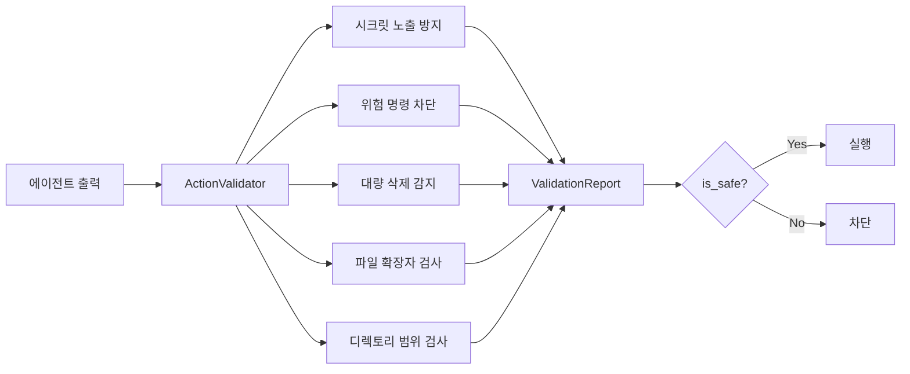

---

## 5. A2A 프로토콜 통합

### 5.1 서버 조립 흐름

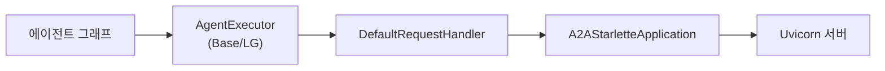

`run_server()` 한 줄로 에이전트를 A2A 서버로 노출:

```python
run_server(
    executor=LGAgentExecutor(graph=agent.graph),
    name="coding-agent",
    port=8080,
)
```

### 5.2 복원력 패턴

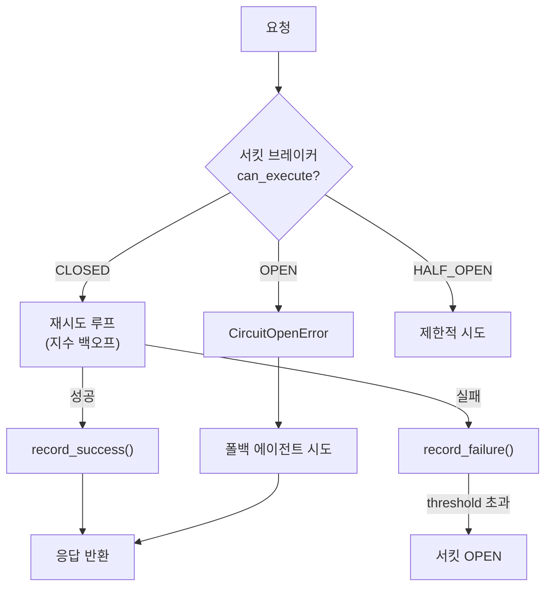

- **RetryPolicy**: 지수 백오프 (base_delay * 2^attempt, max_delay=30s)
- **CircuitBreaker**: 연속 5회 실패 시 OPEN, 30초 후 HALF_OPEN
- **AgentMonitor**: 에이전트별 성공률, 응답 시간, 서킷 상태 추적
- **ResilientA2AClient**: 위 패턴을 통합한 복원력 내장 클라이언트

### 5.3 라우팅 전략

`AgentRouter`는 4가지 라우팅 모드를 지원한다:

| 모드 | 전략 |
|------|------|
| `SKILL_BASED` | 스킬 매칭 점수 + 성공률 종합 평가 (기본) |
| `ROUND_ROBIN` | 순차적 분배 |
| `LEAST_LOADED` | 최소 부하 에이전트 선택 |
| `WEIGHTED` | 성공률 (70%) + 응답시간 역수 (30%) |

---

## 6. CLI 실행 흐름

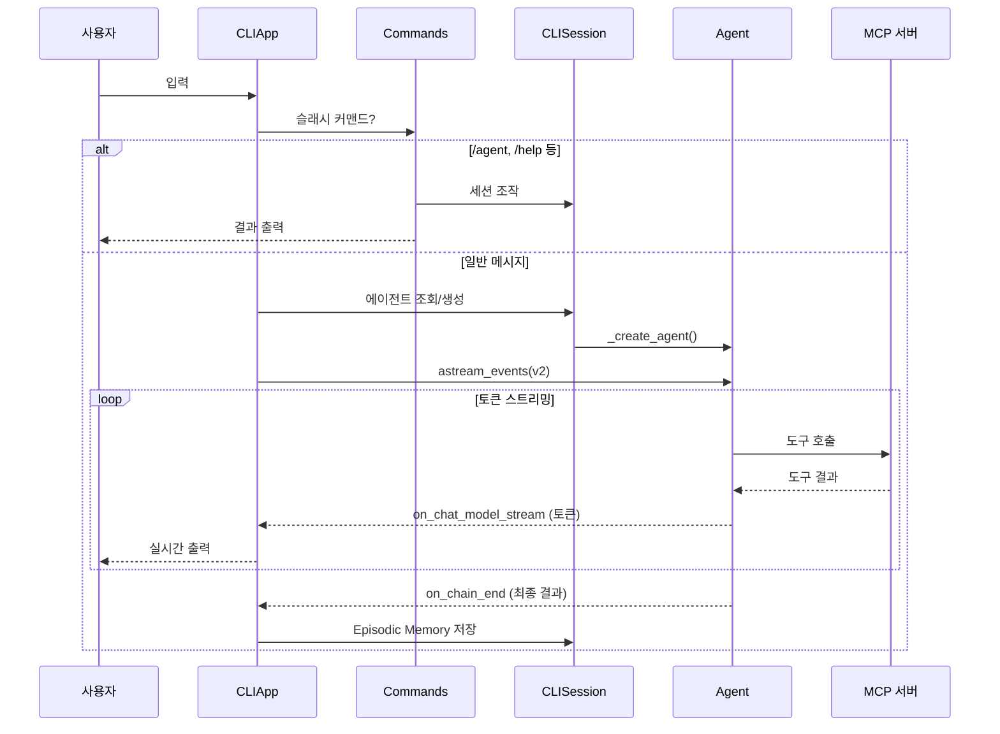

---

## 7. 평가 파이프라인 (Closed-Loop)

```mermaid
graph LR
    subgraph Loop1["Loop 1: Dataset"]
        SYN["Synthesizer<br/>합성 데이터 생성"]
        GOL["GoldenBuilder<br/>골든 데이터셋"]
        AUG["FeedbackAugmenter<br/>피드백 증강"]
        CSV["CSV Export/Import"]
    end

    subgraph Loop2["Loop 2: Evaluation"]
        MET["MetricsRegistry<br/>RAG(4) + Agent(2) + Custom(7)"]
        BAT["BatchEvaluator<br/>오프라인/온라인 평가"]
        LFB["LangfuseBridge<br/>트레이스 fetch/push"]
        CAL["CalibrationCases<br/>교정 데이터"]
    end

    subgraph Loop3["Loop 3: Remediation"]
        ANA["분석 (Analyzer)"]
        OPT["최적화 (Optimizer)"]
        REC["추천 (Recommender)"]
        REP["RecommendationReport"]
    end

    subgraph Observability["관측성"]
        CB["CallbackHandler<br/>Langfuse 트레이싱"]
        LF["Langfuse Dashboard"]
    end

    Loop1 -->|Golden Dataset| Loop2
    Loop2 -->|평가 결과| Loop3
    Loop3 -->|프롬프트 개선| Loop1

    BAT --> LFB
    LFB --> LF
    CB --> LF

    ANA --> OPT --> REC --> REP
    REP -->|get_prompt_changes()| PROMPT["PromptRegistry<br/>프롬프트 버전 관리"]
```

### 평가 흐름 상세

| 단계 | 모듈 | 입력 | 출력 |
|------|------|------|------|
| **Loop 1** | `loop1_dataset/` | 프롬프트 템플릿 | Golden Dataset (JSON/CSV) |
| **Loop 2** | `loop2_evaluation/` | Golden Dataset + Langfuse 트레이스 | 메트릭 점수 + Langfuse Scores |
| **Loop 3** | `loop3_remediation/` | 평가 결과 | RecommendationReport + 프롬프트 개선 |

Loop 2의 **External Evaluation Pipeline** (온라인 평가):

```
1. Fetch: Langfuse SDK로 프로덕션 트레이스 조회
2. Evaluate: DeepEval 메트릭으로 각 트레이스 평가
3. Push: "deepeval.*" 접두사 스코어로 Langfuse에 기록
```

---

## 8. Docker 배포 구성

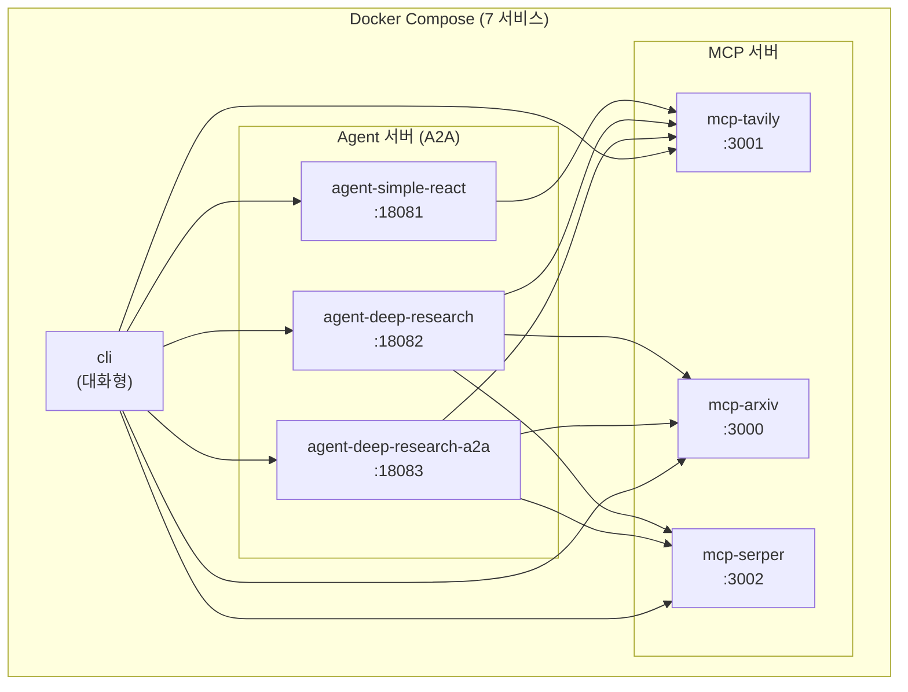

- 모든 서비스는 `youngs75_net` 브리지 네트워크로 연결
- MCP 서버는 헬스체크 후 Agent가 시작
- Agent 서버는 헬스체크 후 CLI가 시작
- Langfuse 인프라는 `docker-compose.langfuse.yaml`로 별도 관리

---

## 9. 설계 원칙 (논문 7편 기반)

| 원칙 | 근거 논문 | 적용 |
|------|-----------|------|
| **최소 구조** | Agent-as-a-Judge | parse -> execute -> verify 3단계 |
| **Generator-Verifier 분리** | RubricRewards | 생성/검증 모델 및 프롬프트 분리 |
| **Safety Envelope** | AutoHarness | ActionValidator (프레임워크 차원 강제) |
| **CoALA 메모리** | CoALA + Voyager | 4종 메모리 (Working/Episodic/Semantic/Procedural) |
| **JIT 원본 참조** | GAM | MCP 도구로 프로젝트 컨텍스트 직접 읽기 |
| **동적 오케스트레이션** | Puppeteer | SubAgentRegistry (R = quality - lambda*cost) |
| **졸업 Lifecycle** | Adaptation | 검증된 에이전트를 A2A 서버로 배포 |

---

## 10. 핵심 설계 패턴

| 패턴 | 적용 위치 |
|------|-----------|
| **Template Method** | `BaseGraphAgent.init_nodes()` / `init_edges()` |
| **Factory Method** | `BaseGraphAgent.create()`, `BaseAgentConfig.get_model()` |
| **Adapter** | `LGAgentExecutor` (LangGraph <-> A2A 프로토콜 브릿지) |
| **Cooperative Cancellation** | 스트림 폴링 + `asyncio.Task.cancel()` 하이브리드 |
| **Graceful Degradation** | MCP 로딩 실패 -> 도구 없이 진행 |
| **Circuit Breaker** | `CircuitBreaker` (CLOSED -> OPEN -> HALF_OPEN 상태 전이) |
| **Subgraph Composition** | Supervisor -> Researcher 서브그래프 중첩 |
| **Override Reducer** | 상태 누적/덮어쓰기 양립 |
| **Singleton** | `PromptRegistry`, `Settings` |
| **Progressive Loading** | Skills 3-Level (L1 메타데이터 -> L2 본문 -> L3 참조) |
