# 아키텍처 문서

**프로젝트**: youngs75-coding-ai-agent
**패키지**: youngs75_a2a
**버전**: 0.1.0
**참조 아키텍처**: AWS Deep Insight (Strands Agents), DeepAgents CLI (패턴 참조, 의존성 없음)

---

## 1. 시스템 전체 구성도

> **SVG 생성 가이드**: 아래 Mermaid 다이어그램을 기반으로 SVG를 생성할 때,
> AWS Deep Insight 블로그의 녹색 사각형 에이전트 구성도 스타일을 참고하세요.
> 어두운 배경(#0f172a), 녹색 테두리(#4ade80)의 메인 에이전트 박스,
> 주황색 테두리(#fb923c)의 인프라 박스, 보라색(#c084fc)의 외부 서비스 박스를 사용합니다.

```mermaid
graph TB
    %% ─────────────────────────────────────────
    %% 사용자 인터페이스
    %% ─────────────────────────────────────────
    User["👤 사용자"]
    CLI["CLI App<br/>(prompt-toolkit + rich)<br/>실시간 스트리밍 · 슬래시 커맨드 · HITL Interrupt"]

    User --> CLI

    %% ─────────────────────────────────────────
    %% 에이전트 오케스트레이션 레이어 (Deep Insight 녹색 박스에 대응)
    %% ─────────────────────────────────────────
    subgraph AgentLayer["🟢 Agent Orchestration Layer (LangGraph)"]
        direction TB

        subgraph HITL["Human-in-the-loop"]
            PlanReview["🔍 Plan Reviewer<br/>LangGraph interrupt()<br/>사용자 승인 대기"]
        end

        %% ── Orchestrator (= Deep Insight의 Coordinator) ──
        ORC["🎯 Orchestrator<br/>(FAST tier · qwen-turbo)<br/>요청 분류 → 라우팅 결정<br/>DELEGATE / COORDINATE / PLAN 모드"]

        %% ── Planner (= Deep Insight의 Planner) ──
        PL["📋 Planner<br/>(REASONING tier · qwen-max)<br/>태스크 분석 · 아키텍처 설계<br/>외부 리서치 · 구조화된 TaskPlan 생성"]

        %% ── Coordinator Mode (= Deep Insight의 Supervisor) ──
        COORD["⚙️ Coordinator Mode<br/>(DAG 기반 병렬 오케스트레이션)<br/>decompose → execute_parallel → synthesize<br/>TaskGraph · BatchExecutor"]

        %% ── Specialized Workers (= Deep Insight의 Coder/Validator/Reporter/Tracker) ──
        subgraph Workers["Specialized Sub-Agents"]
            direction LR
            CA["💻 Coding Assistant<br/>(FAST→STRONG 2-Stage)<br/>parse → memory → execute<br/>→ generate → verify<br/>스킬 자동활성화 · MCP 도구"]
            DR["🔬 Deep Research<br/>(DEFAULT tier)<br/>clarify → brief →<br/>supervisor(loop) → report<br/>병렬 연구 · Episodic 기록"]
            VF["✅ Verifier<br/>(DEFAULT tier)<br/>lint_check → test_check<br/>→ llm_review → aggregate<br/>3단계 코드 품질 검증"]
            SR["⚡ Simple ReAct<br/>(DEFAULT tier)<br/>create_react_agent<br/>MCP 도구 직접 호출<br/>간단 질의 · 파일 조회"]
        end

        %% ── 오케스트레이션 흐름 ──
        CLI --> ORC
        ORC -->|"코딩 태스크"| PL
        PL --> PlanReview
        PlanReview -->|"승인 후 위임"| CA
        ORC -->|"복합 작업"| COORD
        COORD -->|"SubTask 분배<br/>(DAG 의존성 해석)"| Workers
        ORC -->|"리서치 요청"| DR
        ORC -->|"단순 질의"| SR
        CA -->|"검증 요청"| VF
    end

    %% ─────────────────────────────────────────
    %% 코어 프레임워크 (미들웨어 & 인프라)
    %% ─────────────────────────────────────────
    subgraph CoreLayer["🟠 Core Framework (core/)"]
        direction TB

        subgraph AgentBase["에이전트 기반"]
            BGA["BaseGraphAgent<br/>Template Method 패턴<br/>init_nodes() / init_edges()"]
            BAC["BaseAgentConfig<br/>모델 팩토리 · purpose → tier 매핑<br/>DashScope / OpenRouter 자동 선택"]
            MT["ModelTiers<br/>REASONING (qwen-max)<br/>STRONG (qwen-coder-plus)<br/>DEFAULT (qwen-plus)<br/>FAST (qwen-turbo)"]
        end

        subgraph MemorySystem["메모리 시스템 (CoALA 논문)"]
            MEM_W["Working Memory<br/>(= LangGraph messages)"]
            MEM_S["Semantic Memory<br/>프로젝트 규칙 · 컨벤션<br/>AGENTS.md 자동 로딩"]
            MEM_E["Episodic Memory<br/>실행 결과 이력<br/>세션 스코프 · 최대 5개"]
            MEM_P["Procedural Memory<br/>학습된 코드 패턴<br/>Voyager식 누적"]
            MEM_U["User Profile Memory<br/>사용자 선호도"]
            SEARCH["GAM 2단계 검색<br/>1. TagBasedSearch (경량 필터)<br/>2. BM25 ContentSearch (순위)"]
            NOVELTY["Jaccard 유사도<br/>중복 방지"]
        end

        subgraph SkillSystem["스킬 시스템"]
            SKL_L1["L1: Discovery<br/>메타데이터만 로드<br/>(name, tags, description)"]
            SKL_L2["L2: Activation<br/>스킬 본문 로드"]
            SKL_L3["L3: Full<br/>참조 파일 포함"]
            SKL_AUTO["auto_activate_for_task()<br/>task_type → 스킬 태그 매핑<br/>generate→quality, fix→debug 등"]
        end

        subgraph Safety["안전 & 제어"]
            AV["ActionValidator<br/>Safety Envelope<br/>시크릿노출 · 위험명령 · 금지경로 차단"]
            STALL["StallDetector<br/>반복 패턴 감지<br/>루프/중복 자동 탈출"]
            ABORT["AbortController<br/>Graceful Shutdown"]
            BUDGET["TurnBudgetTracker<br/>반복 횟수 제한"]
            PERM["ToolPermissionManager<br/>도구별 권한 검사"]
        end

        subgraph Middleware["미들웨어"]
            HOOKS["HookManager<br/>이벤트 기반 훅 파이프라인<br/>PRE/POST_TOOL_CALL<br/>PRE/POST_NODE<br/>PRE/POST_LLM_CALL<br/>ON_ERROR<br/>우선순위 체이닝 · 취소 지원"]
            CTX["ContextManager<br/>컨텍스트 윈도우 모니터링<br/>Auto-compaction · 메시지 요약"]
            PTE["ParallelToolExecutor<br/>배치 도구 실행<br/>동시성 제한 · 에러 격리"]
        end

        subgraph SubAgentMgmt["서브에이전트 관리"]
            REG["SubAgentRegistry<br/>동적 에이전트 선택<br/>Puppeteer 점수: R = r(q) − λ·C(cost)<br/>사용 통계 추적 · 학습"]
        end

        %% 내부 연결
        SKL_L1 --> SKL_L2 --> SKL_L3
        BAC --> MT
    end

    %% ─────────────────────────────────────────
    %% A2A 프로토콜 계층
    %% ─────────────────────────────────────────
    subgraph A2ALayer["🟣 A2A Protocol Layer (a2a_local/)"]
        direction LR
        EXE["LGAgentExecutor<br/>LangGraph ↔ A2A 브릿지<br/>스트리밍 · 폴링 · 취소"]
        SRV["run_server()<br/>1줄 조립 · Uvicorn"]
        DIS["Discovery<br/>AgentCard 레지스트리"]
        RTR["Router<br/>SKILL_BASED · ROUND_ROBIN<br/>LEAST_LOADED · WEIGHTED"]
        RES_A2A["Resilience<br/>RetryPolicy (지수 백오프)<br/>CircuitBreaker (5회→OPEN→30s→HALF_OPEN)<br/>AgentMonitor"]
        STR["Streaming<br/>청크 단위 SSE 스트리밍"]
    end

    %% ─────────────────────────────────────────
    %% MCP 도구 서버
    %% ─────────────────────────────────────────
    subgraph MCPLayer["🔵 MCP Tool Servers"]
        direction LR
        CT["code_tools :3003<br/>파일 읽기/쓰기 · 디렉토리 탐색<br/>코드 검색 · Python 실행<br/>Git 상태 조회"]
        TV["tavily :3001<br/>웹 검색 · 콘텐츠 추출"]
        AX["arxiv :3000<br/>논문 검색 · 초록 추출"]
        SP["serper :3002<br/>구글 검색 · 뉴스 검색"]
    end

    %% ─────────────────────────────────────────
    %% 평가 파이프라인
    %% ─────────────────────────────────────────
    subgraph EvalLayer["🔴 Evaluation Pipeline (Closed-Loop)"]
        direction LR
        L1["Loop 1: Dataset<br/>Synthesizer → GoldenBuilder<br/>FeedbackAugmenter → CSV Export"]
        L2["Loop 2: Evaluation<br/>MetricsRegistry (RAG4+Agent2+Custom7)<br/>BatchEvaluator · CalibrationCases"]
        L3["Loop 3: Remediation<br/>Analyzer → Optimizer → Recommender<br/>RecommendationReport<br/>get_prompt_changes()"]
        L1 -->|"Golden Dataset"| L2
        L2 -->|"평가 결과"| L3
        L3 -->|"프롬프트 개선"| L1
    end

    %% ─────────────────────────────────────────
    %% LLM Gateway
    %% ─────────────────────────────────────────
    subgraph LLMGateway["☁️ LiteLLM Gateway (:4000)"]
        direction TB
        subgraph DashScope["DashScope (Qwen 공식 API — 주력)"]
            direction LR
            Q_FAST["qwen3.5-flash / qwen-turbo<br/>(FAST tier)"]
            Q_DEFAULT["qwen3.5-plus / qwen-plus<br/>(DEFAULT tier)"]
            Q_STRONG["qwen3-coder-next / qwen3-coder-plus<br/>(STRONG tier)"]
            Q_REASON["qwen3-max / qwen-max<br/>(REASONING tier)"]
        end
        subgraph ExtProviders["외부 프로바이더"]
            direction LR
            OPENROUTER["OpenRouter<br/>qwen3-max · qwen3-coder-plus<br/>deepseek-v3.2 등"]
            CLAUDE_API["Anthropic Claude<br/>claude-sonnet-4 · claude-haiku-4"]
        end
        LANGFUSE_CB["Langfuse 자동 트레이싱<br/>(callbacks: langfuse)"]
    end

    %% ─────────────────────────────────────────
    %% Docker 인프라
    %% ─────────────────────────────────────────
    subgraph DockerInfra["🐳 Docker Compose — Harness Architecture"]
        direction TB
        subgraph DockerServices["5 Services + 1 Optional"]
            direction LR
            DC_DB["PostgreSQL :5432<br/>(LiteLLM 내부 DB)<br/>litellm_db_data volume"]
            DC_LITELLM["litellm-proxy :4000<br/>LLM Gateway + UI<br/>litellm_config.yaml 마운트"]
            DC_MCP["mcp-server :3003<br/>통합 MCP 서버<br/>코드 도구 + 검색<br/>workspace volume 공유"]
            DC_CODING["agent-coding-assistant :18084<br/>CodingAssistant 에이전트<br/>샌드박스 + CLI"]
            DC_ORCH["orchestrator :18080<br/>Orchestrator 에이전트<br/>CodingAssistant 원격 위임"]
            DC_EVAL["eval-runner (선택)<br/>평가 파이프라인<br/>--profile eval"]
        end
        subgraph DockerNetwork["harness_net (bridge)"]
            direction LR
            NET_FLOW["DC_DB → DC_LITELLM → DC_MCP → DC_CODING → DC_ORCH"]
        end
    end

    %% ─────────────────────────────────────────
    %% 주요 연결선
    %% ─────────────────────────────────────────

    %% Agent → Core 의존
    Workers -->|"도구 로딩"| MCPLayer
    Workers <-->|"메모리 R/W"| MemorySystem
    Workers <-->|"스킬 로드"| SkillSystem
    Workers -->|"안전 검증"| Safety
    AgentLayer -->|"미들웨어 적용<br/>(매 노드 실행 시)"| Middleware
    AgentLayer -->|"에이전트 선택"| SubAgentMgmt
    AgentLayer -->|"그래프 빌드"| AgentBase

    %% Agent → A2A
    ORC -->|"원격 위임<br/>(HTTP fallback: 로컬)"| A2ALayer

    %% A2A 내부
    EXE --> SRV
    SRV --> DIS
    RTR --> DIS
    RTR --> RES_A2A
    RES_A2A --> STR

    %% MCP → LLM
    AgentLayer -->|"LLM 호출"| LLMGateway

    %% Eval 연결
    L2 -->|"트레이스 push"| DC_LANGFUSE

    %% Docker 연결
    DockerInfra --> MCPLayer
    DockerInfra --> LLMGateway
```

### 1.1 Deep Insight 아키텍처 대응표

| Deep Insight (AWS Strands Agents) | 우리 프로젝트 | 구현 위치 | 상세 |
|---|---|---|---|
| **Coordinator** | **Orchestrator** | `agents/orchestrator/` | FAST 모델로 요청 분류, DELEGATE/COORDINATE/PLAN 3모드 라우팅 |
| **Planner** | **Planner** | `agents/planner/` | REASONING 모델로 태스크 분석, 아키텍처 설계, 구조화된 TaskPlan 생성 |
| **Plan Reviewer (HITL)** | **Plan Reviewer** | LangGraph `interrupt()` | 사용자가 계획을 승인/수정/거부할 수 있는 Human-in-the-loop 포인트 |
| **Supervisor** | **Coordinator Mode** | `agents/orchestrator/coordinator.py` | DAG 기반 SubTask 분해 → BatchExecutor 병렬 실행 → LLM 결과 합성 |
| **Coder** | **Coding Assistant** | `agents/coding_assistant/` | 2-Stage Pipeline (FAST ReAct → STRONG 코드생성), 스킬 자동활성화 |
| **Validator** | **Verifier** | `agents/verifier/` | lint_check → test_check → llm_review 3단계 코드 품질 검증 |
| **Reporter** | **Deep Research** | `agents/deep_research/` | Supervisor 서브그래프 기반 병렬 연구, 최종 보고서 생성, Episodic 기록 |
| **Tracker** | **StallDetector + HookManager** | `core/hooks.py`, `core/stall_detector.py` | 반복 감지, 메트릭 수집, Langfuse 관측성 이벤트 |
| **Bedrock AgentCore Runtime** | **LiteLLM Gateway** | `docker/litellm_config.yaml` | 멀티 모델 라우팅 (Qwen3 4-Tier + Claude + OpenRouter) |
| **ECS + ALB** | **Docker Compose** | `docker/docker-compose.harness.yml` | 4+ 컨테이너 (agent, litellm, mcp-code, mcp-web, langfuse) |
| **S3 Bucket** | **파일시스템 + Memory 영속화** | `{workspace}/.ai/memory/*.jsonl` | CoALA 4종 메모리 JSONL 파일 기반 영속화 |
| **Strands Agents SDK** | **LangGraph + 자체 프레임워크** | `core/base_agent.py` | Template Method 패턴, StateGraph 기반 에이전트 빌더 |

---

## 2. 요청 흐름 (Orchestrator-First 아키텍처)

모든 사용자 요청은 Orchestrator를 거쳐 적합한 Subagent로 라우팅됩니다.

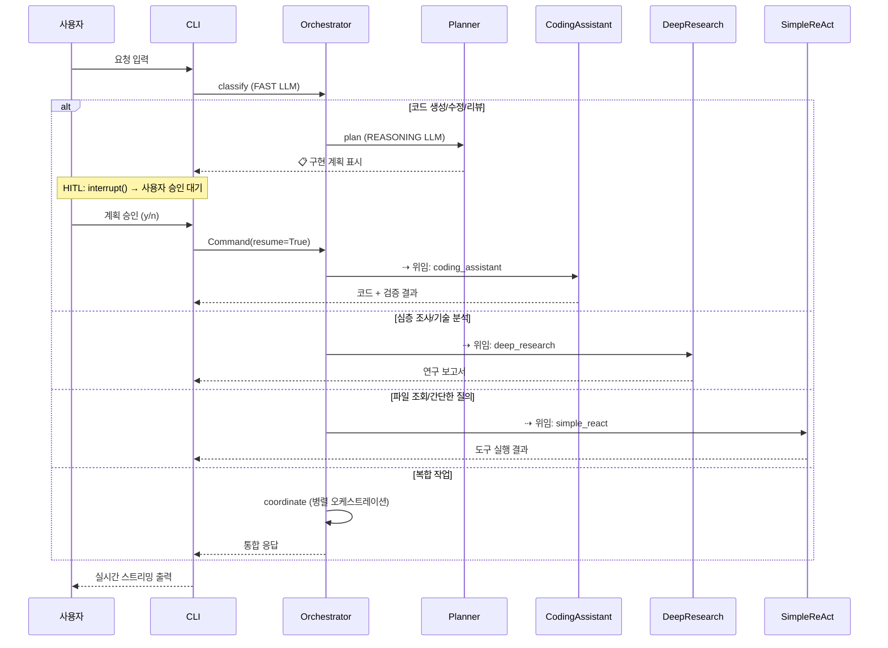

---

## 3. 3계층 분리 아키텍처

본 프레임워크는 **관심사 분리** 원칙에 따라 3개 계층으로 구성된다.

| 계층 | 디렉토리 | 역할 | 의존 방향 |
|------|----------|------|-----------|
| **Core** | `core/` | 도메인 무관 프레임워크 | 없음 (최하위) |
| **A2A** | `a2a_local/` | 프로토콜 통합 | Core |
| **Agents** | `agents/` | 도메인별 에이전트 구현 | Core, A2A |

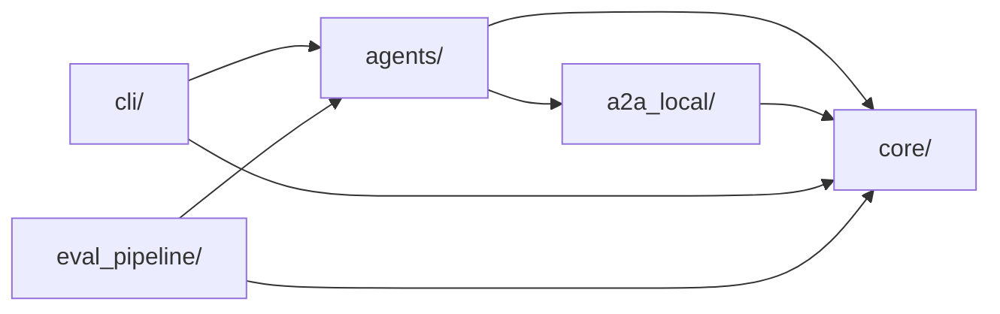

새 에이전트를 추가할 때 `agents/` 디렉토리에 구현하면 `core/`와 `a2a_local/` 인프라를 그대로 재사용할 수 있다.

---

## 4. 에이전트별 그래프 흐름도

### 4.1 CodingAssistantAgent (2단계 파이프라인)

논문 인사이트 기반 설계:
- **P1** (Agent-as-a-Judge): parse → execute → verify 최소 3단계
- **P2** (RubricRewards): Generator/Verifier 모델 분리 + 도구 호출/코드 생성 모델 분리
- **P5** (GAM): MCP 도구를 통한 JIT 원본 참조

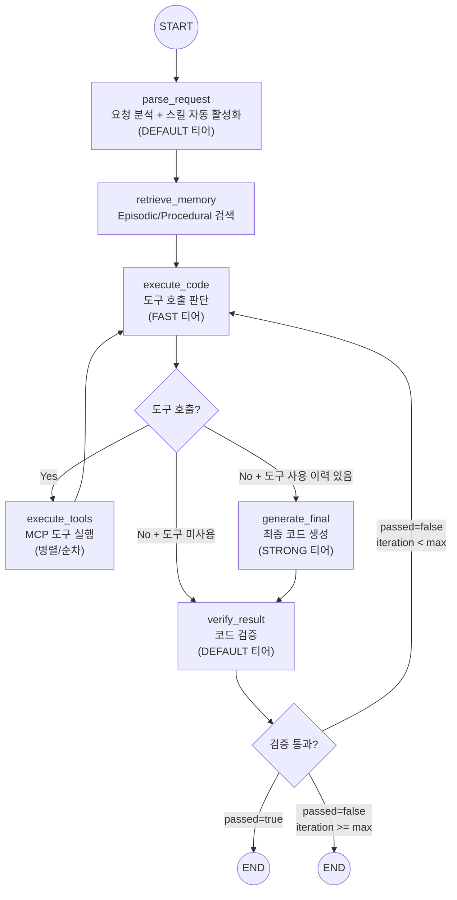

**2단계 파이프라인 라우팅 로직:**
- 도구 호출 있음 → `EXECUTE_TOOLS` → `EXECUTE` (ReAct 루프, FAST 모델)
- 도구 호출 없음 + 이전에 도구 사용함 → `GENERATE_FINAL` (STRONG 모델로 최종 생성)
- 도구 호출 없음 + 도구 미사용 → `VERIFY` (FAST 출력 그대로 검증, STRONG 생략)

**비용 최적화**: 단순 코드 생성(도구 불필요)은 FAST 모델만 사용하여 비용 90% 절감.

**목적별 모델 매핑:**
| purpose | tier | 노드 |
|---------|------|------|
| `parsing` | FAST | parse_request |
| `tool_planning` | FAST | execute_code (ReAct 루프) |
| `generation` | STRONG | generate_final |
| `verification` | DEFAULT | verify_result |

**상태 스키마**: `CodingState`
- `messages`: 대화 이력 (add_messages 누적)
- `semantic_context`: Semantic Memory (프로젝트 규칙/컨벤션)
- `skill_context`: Skills 본문 (L2, 자동 활성화된 스킬)
- `episodic_log`: Episodic Memory (이전 실행 이력)
- `procedural_skills`: Procedural Memory (학습된 코드 패턴)
- `parse_result`: 요청 분석 결과 (task_type, language, description 등)
- `generated_code`: 생성된 코드
- `verify_result`: 검증 결과 (`passed`, `issues`, `suggestions`)
- `project_context`: JIT 원본 참조 결과
- `iteration` / `max_iterations`: 반복 제어
- `tool_call_count`: ReAct 루프 내 도구 호출 누적 횟수

### 4.2 OrchestratorAgent (기본 에이전트)

모든 사용자 요청의 진입점. 요청을 분류하여 적합한 Subagent에 위임.

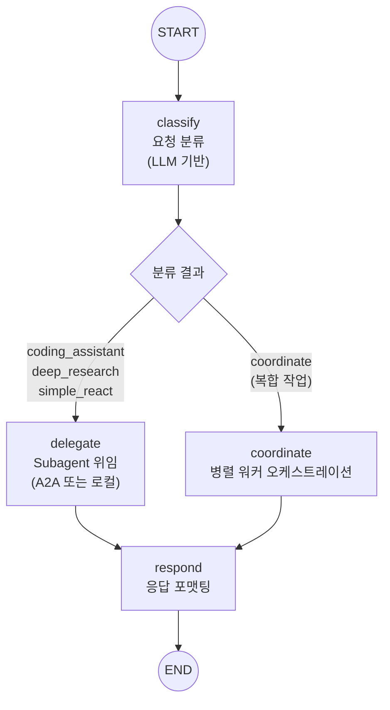

**위임 전략 (우선순위):**
1. A2A 프로토콜 (HTTP 엔드포인트가 설정된 경우)
2. 로컬 에이전트 직접 호출 (폴백)

**등록된 Subagent:**
| 에이전트 | 설명 |
|----------|------|
| `coding_assistant` | 코드 생성, 수정, 리팩토링, 버그 수정, 코드 리뷰 |
| `deep_research` | 심층 조사, 리서치, 기술 분석, 보고서 작성 |
| `simple_react` | MCP 도구를 사용한 간단한 질의응답, 파일 조회 |

### 4.3 DeepResearchAgent

다단계 심층 연구 워크플로우.

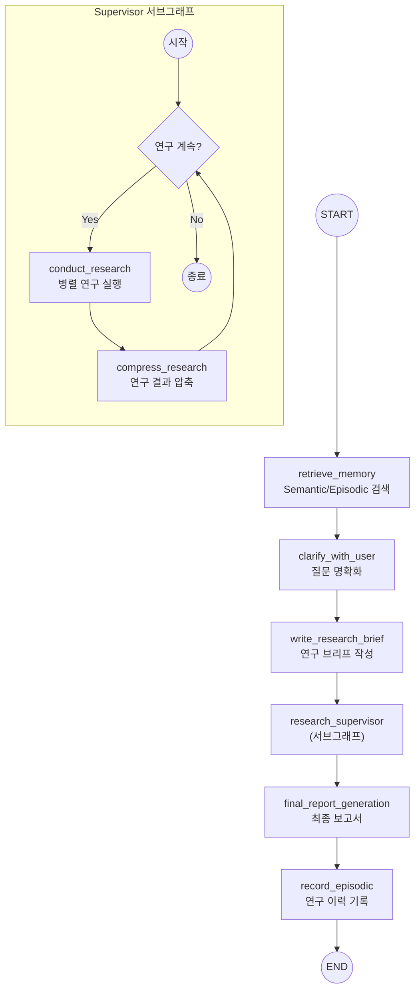

### 4.4 SimpleMCPReActAgent

LangGraph `create_react_agent` 기반 단일 노드 에이전트.

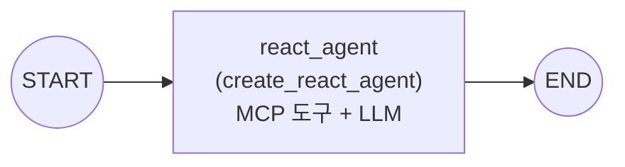

---

## 5. 코어 프레임워크 구조

### 5.1 BaseGraphAgent (Template Method 패턴)

모든 에이전트의 기반 클래스. 서브클래스는 `init_nodes()`와 `init_edges()`만 구현하면 된다.

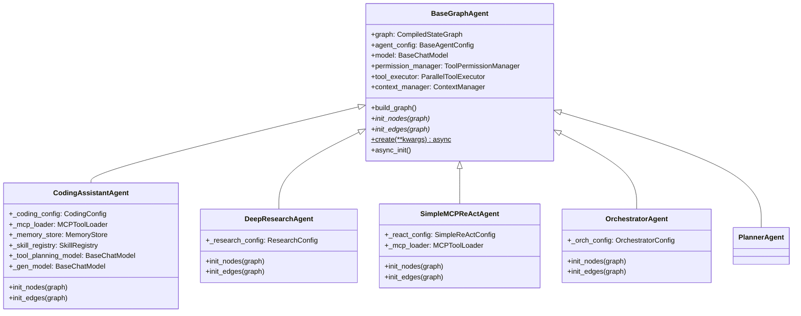

### 5.2 BaseAgentConfig (모델 해석 체계)

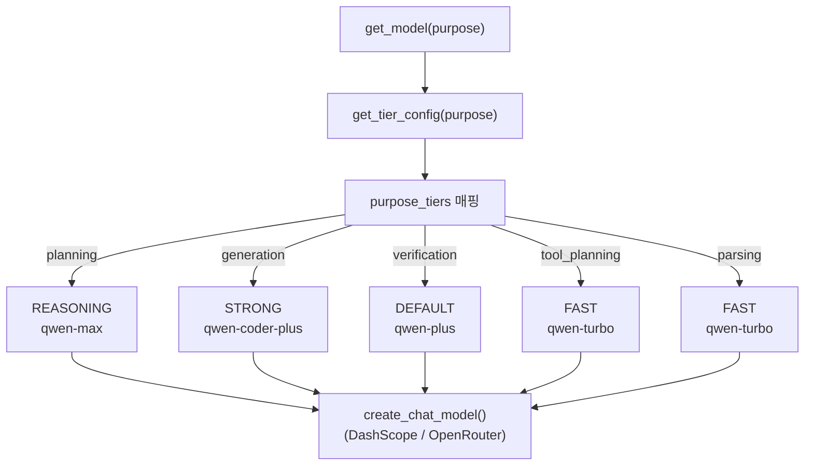

CodingConfig는 환경변수(`CODING_GEN_MODEL` 등)가 있으면 티어보다 우선 적용한다.

### 5.3 메모리 시스템 (CoALA 논문 기반)

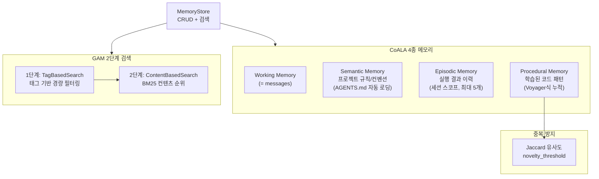

### 5.4 Skills 시스템 (3-Level Progressive Loading + 자동 활성화)

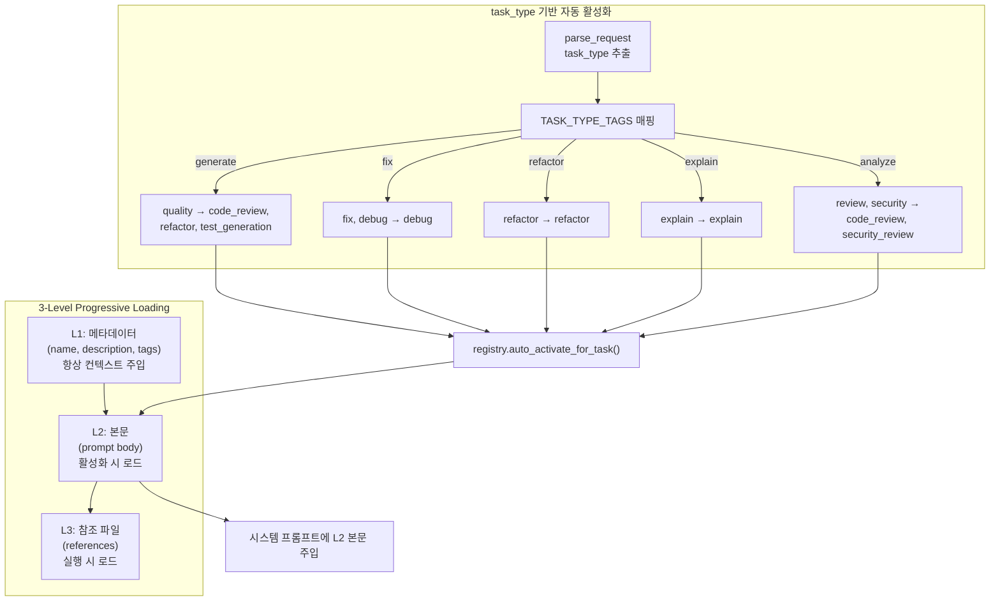

- `SkillLoader`: YAML/JSON 파일에서 스킬 로드
- `SkillRegistry`: 스킬 등록, 검색, 활성화 관리 + `auto_activate_for_task()`
- 수동 활성화: `/skill activate <name>`

### 5.5 SubAgent 동적 선택 (Puppeteer 논문 기반)

```
R = r(quality) - lambda * C(cost)

quality: 에이전트의 태스크 유형별 성공률 (70%) + 전체 성공률 (30%)
cost:    에이전트의 cost_weight (레이턴시 + 토큰 비용 대리)
lambda:  비용 민감도 (환경변수로 조정)
```

`SubAgentRegistry`가 사용 통계를 추적하여 선택 품질을 지속적으로 개선한다.

### 5.6 ActionValidator (Safety Envelope)

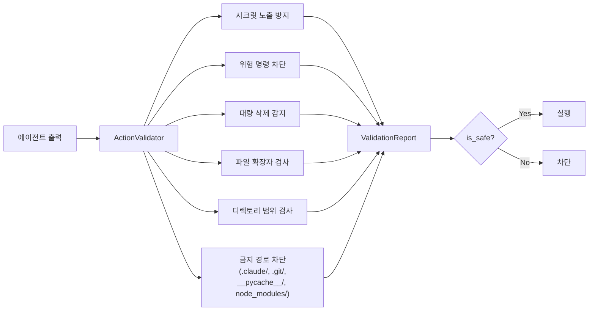

---

## 6. A2A 프로토콜 통합

### 6.1 서버 조립 흐름

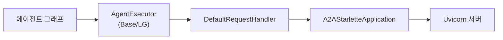

`run_server()` 한 줄로 에이전트를 A2A 서버로 노출:

```python
run_server(
    executor=LGAgentExecutor(graph=agent.graph),
    name="coding-agent",
    port=8080,
)
```

### 6.2 복원력 패턴

- **RetryPolicy**: 지수 백오프 (base_delay * 2^attempt, max_delay=30s)
- **CircuitBreaker**: 연속 5회 실패 시 OPEN, 30초 후 HALF_OPEN
- **AgentMonitor**: 에이전트별 성공률, 응답 시간, 서킷 상태 추적
- **ResilientA2AClient**: 위 패턴을 통합한 복원력 내장 클라이언트

### 6.3 라우팅 전략

`AgentRouter`는 4가지 라우팅 모드를 지원한다:

| 모드 | 전략 |
|------|------|
| `SKILL_BASED` | 스킬 매칭 점수 + 성공률 종합 평가 (기본) |
| `ROUND_ROBIN` | 순차적 분배 |
| `LEAST_LOADED` | 최소 부하 에이전트 선택 |
| `WEIGHTED` | 성공률 (70%) + 응답시간 역수 (30%) |

---

## 7. CLI 실행 흐름

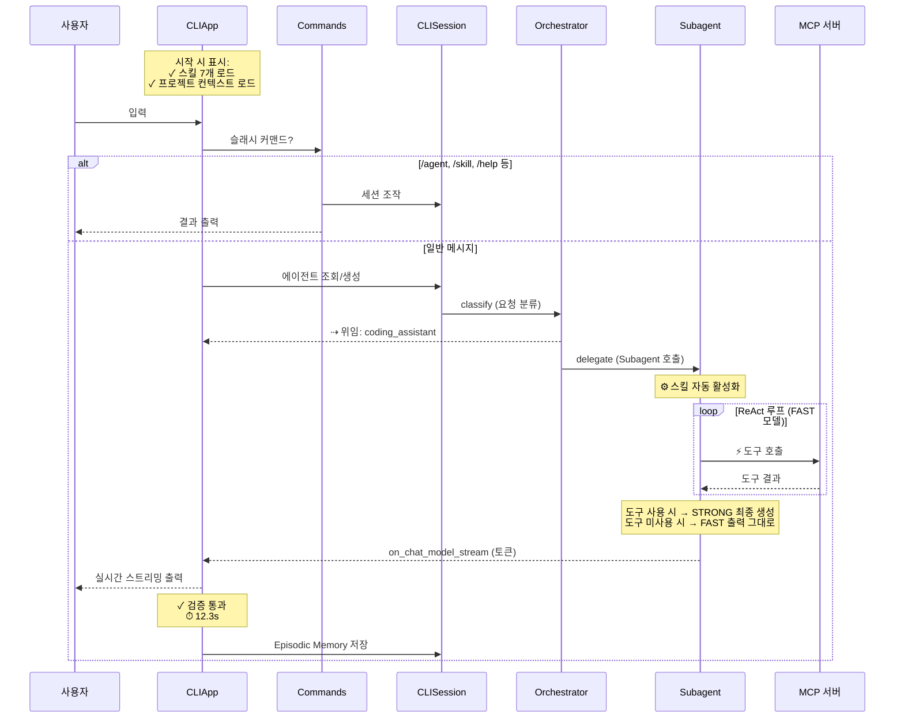

### CLI UX 피드백

| 시점 | 표시 | 의미 |
|------|------|------|
| 시작 | `✓ 스킬 7개 로드: ...` | 사용 가능한 스킬 목록 |
| parse 후 | `⚙ 스킬 활성화: debug` | task_type 기반 자동 스킬 선택 |
| 도구 호출 | `⚡ read_file pyproject.toml` | MCP 도구 실행 |
| 스피너 | `⠋ 도구 호출 판단 (FAST)` | FAST 모델 ReAct 루프 |
| 스피너 | `⠋ 코드 생성 (STRONG)` | STRONG 모델 최종 생성 |
| Orchestrator | `⇢ 위임: coding_assistant` | Subagent 위임 |
| 검증 | `✓ 검증 통과` / `✗ 검증 실패` | 코드 품질 검증 |
| 종료 | `⏱ 12.3s` | 턴 소요시간 |

---

## 8. 평가 파이프라인 (Closed-Loop)

```mermaid
graph LR
    subgraph Loop1["Loop 1: Dataset"]
        SYN["Synthesizer<br/>합성 데이터 생성"]
        GOL["GoldenBuilder<br/>골든 데이터셋"]
        AUG["FeedbackAugmenter<br/>피드백 증강"]
        CSV["CSV Export/Import"]
    end

    subgraph Loop2["Loop 2: Evaluation"]
        MET["MetricsRegistry<br/>RAG(4) + Agent(2) + Custom(7)"]
        BAT["BatchEvaluator<br/>오프라인/온라인 평가"]
        LFB["LangfuseBridge<br/>트레이스 fetch/push"]
        CAL["CalibrationCases<br/>교정 데이터"]
    end

    subgraph Loop3["Loop 3: Remediation"]
        ANA["분석 (Analyzer)"]
        OPT["최적화 (Optimizer)"]
        REC["추천 (Recommender)"]
        REP["RecommendationReport"]
    end

    Loop1 -->|Golden Dataset| Loop2
    Loop2 -->|평가 결과| Loop3
    Loop3 -->|프롬프트 개선| Loop1

    BAT --> LFB
    LFB --> LF["Langfuse Dashboard"]
    ANA --> OPT --> REC --> REP
    REP -->|get_prompt_changes()| PROMPT["PromptRegistry<br/>프롬프트 버전 관리"]
```

---

## 9. Docker 배포 구성 (Harness Architecture)

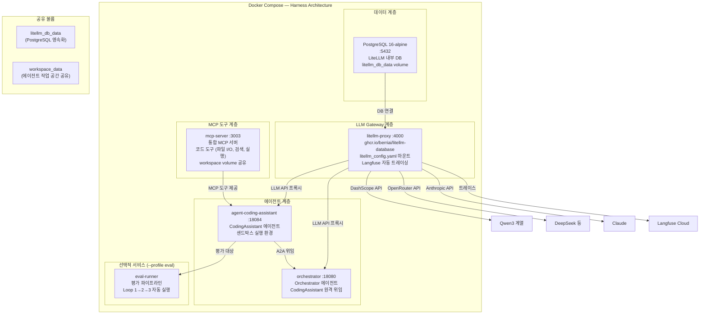

**서비스 의존성 체인:**
```
litellm-db (healthy)
  → litellm-proxy (healthy)
    → mcp-server (healthy)
      → agent-coding-assistant (healthy)
        → orchestrator (healthy)
          → eval-runner (선택)
```

**운영 명령어:**
| 명령 | 설명 |
|------|------|
| `make up-harness` | 전체 기동 (5 서비스) |
| `make health-check` | 헬스체크 |
| `./youngs75-agent.sh` | CLI 접속 (docker exec) |
| `./youngs75-agent.sh --export` | 결과물 추출 |
| `make down-harness` | 종료 |

---

## 10. 설계 원칙 (논문 7편 기반)

| 원칙 | 근거 논문 | 적용 |
|------|-----------|------|
| **최소 구조** | Agent-as-a-Judge | parse → execute → verify 3단계 |
| **Generator-Verifier 분리** | RubricRewards | 생성(STRONG)/검증(DEFAULT) 모델 분리 |
| **2단계 파이프라인** | 비용 최적화 | 도구 호출(FAST)/최종 생성(STRONG) 분리 |
| **Safety Envelope** | AutoHarness | ActionValidator + 금지 경로 차단 |
| **CoALA 메모리** | CoALA + Voyager | 4종 메모리 + Semantic 자동 로딩 |
| **JIT 원본 참조** | GAM | MCP 도구로 프로젝트 컨텍스트 직접 읽기 |
| **동적 오케스트레이션** | Puppeteer | Orchestrator-First + SubAgent 위임 |
| **스킬 자동 활성화** | Claude Code 패턴 | task_type → 스킬 태그 매핑 |

---

## 11. 핵심 설계 패턴

| 패턴 | 적용 위치 |
|------|-----------|
| **Template Method** | `BaseGraphAgent.init_nodes()` / `init_edges()` |
| **Factory Method** | `BaseGraphAgent.create()`, `BaseAgentConfig.get_model()` |
| **Adapter** | `LGAgentExecutor` (LangGraph ↔ A2A 프로토콜 브릿지) |
| **Orchestrator-First** | 모든 요청이 Orchestrator → Subagent 라우팅 |
| **2-Stage Pipeline** | FAST(도구 판단) → STRONG(최종 생성) 모델 분리 |
| **Progressive Loading** | Skills 3-Level (L1 메타데이터 → L2 본문 → L3 참조) |
| **Circuit Breaker** | `CircuitBreaker` (CLOSED → OPEN → HALF_OPEN 상태 전이) |
| **Subgraph Composition** | Supervisor → Researcher 서브그래프 중첩 |
| **Override Reducer** | 상태 누적/덮어쓰기 양립 |

---

## 12. SVG 아키텍처 다이어그램 생성 가이드

> 이 섹션은 Claude 웹(Opus 4.6)에게 SVG를 생성 요청할 때 사용하는 상세 스펙입니다.

### 12.1 디자인 스타일

AWS Deep Insight 블로그 아키텍처 다이어그램 스타일을 참고합니다:
- **배경**: 어두운 네이비(#0f172a → #1e293b 그라디언트)
- **메인 에이전트 박스**: 녹색 테두리(#4ade80), 반투명 배경(rgba(34,197,94,0.08))
- **코어/인프라 박스**: 주황색 테두리(#fb923c)
- **외부 서비스 박스**: 보라색 테두리(#c084fc)
- **Docker/인프라**: 청색 테두리(#38bdf8)
- **평가 파이프라인**: 빨간색 테두리(#f87171)
- **텍스트**: 흰색(#f8fafc) 제목, 회색(#94a3b8) 설명
- **연결선**: 점선(위임), 실선(데이터 흐름), 화살표 마커

### 12.2 전체 레이아웃 (위→아래)

```
┌─────────────────────────────────────────────────────────────────────┐
│  타이틀 바: "youngs75-coding-ai-agent — System Architecture"        │
│  부제: "Orchestrator-First Multi-Agent · LangGraph + A2A + MCP"    │
├─────────────────────────────────────────────────────────────────────┤
│                                                                     │
│  👤 사용자 → CLI App (prompt-toolkit + rich)                        │
│            실시간 스트리밍 · 슬래시 커맨드 · HITL Interrupt           │
│                          ↓                                          │
├─────────────────────────────────────────────────────────────────────┤
│  🟢 Agent Orchestration Layer (녹색 테두리 대형 박스)                │
│  ┌──────────────────────────────────────────────────────────┐      │
│  │                                                          │      │
│  │  ┌─────────────┐   Human-in-the-loop                    │      │
│  │  │Plan Reviewer │←── interrupt() 승인 대기               │      │
│  │  └──────┬──────┘                                         │      │
│  │         ↑                                                │      │
│  │  ┌──────────────────────────────────────────────┐       │      │
│  │  │ Orchestrator (FAST tier · qwen-turbo)         │       │      │
│  │  │ 요청 분류 → DELEGATE / COORDINATE / PLAN 모드 │       │      │
│  │  └──┬──────────┬──────────┬──────────┬──────────┘       │      │
│  │     │          │          │          │                    │      │
│  │     ↓          ↓          ↓          ↓                   │      │
│  │  ┌──────┐  ┌──────┐  ┌──────────────────────┐          │      │
│  │  │Planner│  │Simple│  │ Coordinator Mode     │          │      │
│  │  │REASON │  │ReAct │  │ DAG분해→병렬실행→합성 │          │      │
│  │  └──┬───┘  └──────┘  └──────────┬───────────┘          │      │
│  │     │                           │                        │      │
│  │     ↓ (승인 후)                  ↓ (SubTask 분배)        │      │
│  │  ┌──────────────────────────────────────────────┐       │      │
│  │  │            Specialized Sub-Agents             │       │      │
│  │  │ ┌────────────┐ ┌────────────┐ ┌────────────┐│       │      │
│  │  │ │💻 Coding   │ │🔬 Deep     │ │✅ Verifier ││       │      │
│  │  │ │ Assistant  │ │ Research   │ │            ││       │      │
│  │  │ │FAST→STRONG │ │Supervisor  │ │lint→test→  ││       │      │
│  │  │ │2-Stage     │ │서브그래프  │ │llm_review  ││       │      │
│  │  │ │Pipeline    │→│병렬연구    │ │3단계 검증  ││       │      │
│  │  │ └────────────┘ └────────────┘ └────────────┘│       │      │
│  │  └──────────────────────────────────────────────┘       │      │
│  └──────────────────────────────────────────────────────────┘      │
│                          ↓ ↓ ↓                                     │
├─────────────────────────────────────────────────────────────────────┤
│  🟠 Core Framework (주황 테두리)        🟣 A2A Protocol (보라 테두리)│
│  ┌─────────────────────────────┐  ┌─────────────────────────┐     │
│  │ BaseGraphAgent  ModelTiers  │  │ LGAgentExecutor         │     │
│  │ Template Method  4-Tier     │  │ run_server() 1줄 조립   │     │
│  │                             │  │ Discovery · Router      │     │
│  │ Memory (CoALA 4종)          │  │ Resilience              │     │
│  │  Working · Semantic         │  │  RetryPolicy (지수백오프)│     │
│  │  Episodic · Procedural      │  │  CircuitBreaker         │     │
│  │  GAM 2단계 검색             │  │  (5회→OPEN→30s→HALF)    │     │
│  │                             │  │ Streaming (SSE 청크)    │     │
│  │ Skills (3-Level Loading)    │  └─────────────────────────┘     │
│  │  L1 Discovery → L2 → L3    │                                   │
│  │  auto_activate_for_task()   │                                   │
│  │                             │                                   │
│  │ Safety & Control            │                                   │
│  │  ActionValidator            │                                   │
│  │  StallDetector · Abort      │                                   │
│  │  TurnBudget · ToolPerm      │                                   │
│  │                             │                                   │
│  │ Middleware                  │                                   │
│  │  HookManager (7 events)    │                                   │
│  │  ContextManager (compact)  │                                   │
│  │  ParallelToolExecutor      │                                   │
│  │                             │                                   │
│  │ SubAgentRegistry           │                                   │
│  │  Puppeteer: R=r(q)−λ·C    │                                   │
│  └─────────────────────────────┘                                   │
│                          ↓                                          │
├─────────────────────────────────────────────────────────────────────┤
│  🔵 MCP Tool Servers              🔴 Eval Pipeline (Closed-Loop)  │
│  ┌─────────────────────────┐  ┌─────────────────────────────────┐ │
│  │ code_tools :3003        │  │ Loop1: Dataset (합성→골든)       │ │
│  │  파일 R/W · 검색 · 실행  │  │   ↓                             │ │
│  │  Git 상태 · Python 실행  │  │ Loop2: Evaluation (13 메트릭)   │ │
│  │                         │  │   ↓                             │ │
│  │ tavily (웹검색)         │  │ Loop3: Remediation              │ │
│  │ arxiv (논문검색)        │  │   ↓ (프롬프트 개선 → Loop1)     │ │
│  │ serper (구글검색)       │  └─────────────────────────────────┘ │
│  └─────────────────────────┘                                       │
│                          ↓                                          │
├─────────────────────────────────────────────────────────────────────┤
│  🐳 Docker Compose — Harness Architecture                          │
│  ┌─────────────────────────────────────────────────────────────┐   │
│  │ ┌──────────┐  ┌──────────────┐  ┌──────────────┐          │   │
│  │ │PostgreSQL│→│litellm-proxy │→│ mcp-server   │          │   │
│  │ │:5432     │  │:4000         │  │ :3003        │          │   │
│  │ │LiteLLM DB│  │LLM Gateway   │  │ 통합MCP 도구 │          │   │
│  │ └──────────┘  └──────────────┘  └──────┬───────┘          │   │
│  │                                         ↓                  │   │
│  │               ┌──────────────────┐  ┌──────────────┐      │   │
│  │               │agent-coding-asst │←│ orchestrator │      │   │
│  │               │:18084            │  │ :18080       │      │   │
│  │               │CodingAssistant   │  │ Orchestrator │      │   │
│  │               └──────────────────┘  └──────────────┘      │   │
│  │               ┌──────────────┐  (선택: --profile eval)     │   │
│  │               │ eval-runner  │                              │   │
│  │               └──────────────┘                              │   │
│  └─────────────────────────────────────────────────────────────┘   │
│                          ↓                                          │
├─────────────────────────────────────────────────────────────────────┤
│  ☁️ External Services                                               │
│  ┌──────────────┐ ┌──────────────┐ ┌──────────────┐              │
│  │ DashScope    │ │ OpenRouter   │ │ Anthropic    │              │
│  │ Qwen3 계열   │ │ DeepSeek 등  │ │ Claude       │              │
│  │ (주력 LLM)   │ │ (오픈소스)    │ │ (폴백)       │              │
│  └──────────────┘ └──────────────┘ └──────────────┘              │
│  ┌──────────────┐                                                 │
│  │ Langfuse     │ ← LiteLLM callbacks 자동 트레이싱              │
│  │ Cloud        │                                                 │
│  └──────────────┘                                                 │
├─────────────────────────────────────────────────────────────────────┤
│  📚 Design Principles — 7 Papers                                   │
│  Agent-as-a-Judge · RubricRewards · CoALA+Voyager · GAM ·         │
│  Puppeteer · AutoHarness · Claude Code 패턴                       │
└─────────────────────────────────────────────────────────────────────┘
```

### 12.3 컴포넌트 상세 목록 (SVG에 포함할 내용)

#### A. Agent Orchestration Layer (녹색 박스)

| 컴포넌트 | 역할 | 모델 티어 | 내부 노드 흐름 | Deep Insight 대응 |
|----------|------|----------|---------------|-------------------|
| **Orchestrator** | 요청 분류 → 라우팅 결정 | FAST (qwen-turbo) | classify → {delegate \| coordinate} → respond | Coordinator |
| **Planner** | 태스크 분석, 아키텍처 설계 | REASONING (qwen-max) | analyze → research → explore → create_plan | Planner |
| **Plan Reviewer** | 사용자 승인 대기 (HITL) | - | LangGraph interrupt() | Plan Reviewer |
| **Coordinator Mode** | 복합 작업 병렬 오케스트레이션 | - | decompose → execute_parallel(DAG) → synthesize | Supervisor |
| **Coding Assistant** | 코드 생성/수정/리팩토링 | FAST→STRONG 2-Stage | parse → memory → execute(ReAct) → generate → verify | Coder |
| **Deep Research** | 심층 연구, 보고서 작성 | DEFAULT (qwen-plus) | clarify → brief → supervisor(loop) → report → episodic | Reporter |
| **Verifier** | 코드 품질 3단계 검증 | DEFAULT (qwen-plus) | lint_check → test_check → llm_review → aggregate | Validator |
| **Simple ReAct** | 간단 질의, 파일 조회 | DEFAULT (qwen-plus) | react_agent (create_react_agent) | - |

#### B. Core Framework (주황 박스)

| 컴포넌트 | 역할 | 상세 |
|----------|------|------|
| **BaseGraphAgent** | 에이전트 템플릿 | Template Method: init_nodes() / init_edges() 오버라이드 |
| **BaseAgentConfig** | 모델 팩토리 | purpose → tier → model 해석, DashScope/OpenRouter 자동선택 |
| **ModelTiers** | 4-Tier 모델 체계 | REASONING(qwen-max), STRONG(qwen-coder-plus), DEFAULT(qwen-plus), FAST(qwen-turbo) |
| **Memory (CoALA)** | 4종 메모리 시스템 | Working(messages), Semantic(규칙), Episodic(이력), Procedural(패턴), UserProfile(선호) |
| **GAM Search** | 2단계 검색 | TagBasedSearch(경량필터) → BM25 ContentSearch(순위) |
| **Skills** | 3-Level 스킬 시스템 | L1(메타)→L2(본문)→L3(참조), auto_activate_for_task() |
| **ActionValidator** | Safety Envelope | 시크릿노출, 위험명령, 대량삭제, 금지경로(.git, __pycache__) 차단 |
| **StallDetector** | 반복 감지 | 루프/중복 패턴 자동 탈출 |
| **AbortController** | Graceful Shutdown | 비동기 취소 지원 |
| **TurnBudgetTracker** | 반복 횟수 제한 | max_iterations 기반 |
| **ToolPermissionManager** | 도구 권한 검사 | 사전 실행 권한 체크, 도구 필터링 |
| **HookManager** | 이벤트 훅 파이프라인 | PRE/POST_TOOL_CALL, PRE/POST_NODE, PRE/POST_LLM_CALL, ON_ERROR |
| **ContextManager** | 컨텍스트 관리 | 윈도우 모니터링, Auto-compaction, 메시지 요약 |
| **ParallelToolExecutor** | 병렬 도구 실행 | 배치 실행, 동시성 제한, 에러 격리 |
| **SubAgentRegistry** | 동적 에이전트 선택 | Puppeteer 점수: R = r(quality) − λ·C(cost), 사용 통계 학습 |

#### C. A2A Protocol Layer (보라 박스)

| 컴포넌트 | 역할 |
|----------|------|
| **LGAgentExecutor** | LangGraph ↔ A2A 브릿지, 스트리밍/폴링/취소 |
| **run_server()** | 1줄 조립으로 에이전트를 A2A 서버로 노출 |
| **Discovery** | AgentCard 레지스트리 |
| **Router** | SKILL_BASED, ROUND_ROBIN, LEAST_LOADED, WEIGHTED 4모드 |
| **Resilience** | RetryPolicy(지수백오프), CircuitBreaker(5회→OPEN→30s→HALF_OPEN), AgentMonitor |
| **Streaming** | SSE 청크 단위 스트리밍 |

#### D. Docker Compose (청색 박스)

| 서비스 | 포트 | 이미지 | 역할 |
|--------|------|--------|------|
| **litellm-db** | :5432 | postgres:16-alpine | LiteLLM 내부 PostgreSQL DB |
| **litellm-proxy** | :4000 | ghcr.io/berriai/litellm-database | LLM Gateway + Langfuse 트레이싱 |
| **mcp-server** | :3003 | 커스텀 빌드 | 통합 MCP 서버 (코드 도구 + 검색) |
| **agent-coding-assistant** | :18084 | 커스텀 빌드 | CodingAssistant 에이전트 (샌드박스) |
| **orchestrator** | :18080 | 커스텀 빌드 | Orchestrator 에이전트 |
| **eval-runner** | - | 커스텀 빌드 | 평가 파이프라인 (--profile eval, 선택) |

#### E. LiteLLM 모델 목록

| 프로바이더 | 모델 | 용도 |
|-----------|------|------|
| **DashScope** | qwen3.5-flash, qwen-turbo | FAST tier — 분류, 파싱, 도구 판단 |
| **DashScope** | qwen3.5-plus, qwen-plus | DEFAULT tier — 분석, 검증, 연구 |
| **DashScope** | qwen3-coder-next, qwen3-coder-plus | STRONG tier — 코드 생성 |
| **DashScope** | qwen3-max, qwen-max | REASONING tier — 계획, 아키텍처 |
| **OpenRouter** | qwen3-max, qwen3-coder-plus, deepseek-v3.2 | 대체 라우팅 |
| **Anthropic** | claude-sonnet-4, claude-haiku-4 | 고급 추론 / 폴백 |

#### F. MCP 도구 서버

| 서버 | 포트 | 도구 목록 |
|------|------|----------|
| **code_tools** | :3003 | read_file, write_file, list_directory, search_code, run_python, git_status |
| **tavily** | :3001 | web_search, content_extract |
| **arxiv** | :3000 | paper_search, abstract_extract |
| **serper** | :3002 | google_search, news_search |

#### G. 평가 파이프라인 (Closed-Loop)

| 루프 | 구성요소 | 메트릭/출력 |
|------|---------|------------|
| **Loop 1: Dataset** | Synthesizer → GoldenBuilder → FeedbackAugmenter → CSV | 합성 데이터 + 골든 데이터셋 |
| **Loop 2: Evaluation** | MetricsRegistry → BatchEvaluator → LangfuseBridge → CalibrationCases | RAG(4) + Agent(2) + Custom(7) = 13 메트릭 |
| **Loop 3: Remediation** | Analyzer → Optimizer → Recommender → RecommendationReport | get_prompt_changes() → 프롬프트 개선 → Loop1 피드백 |
