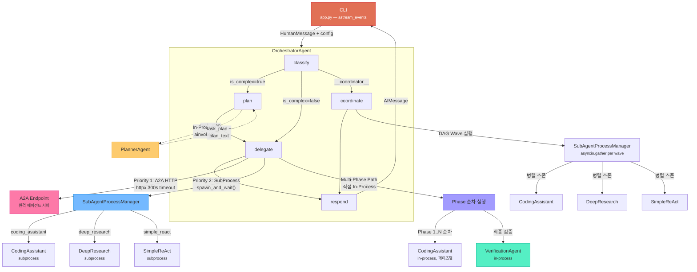
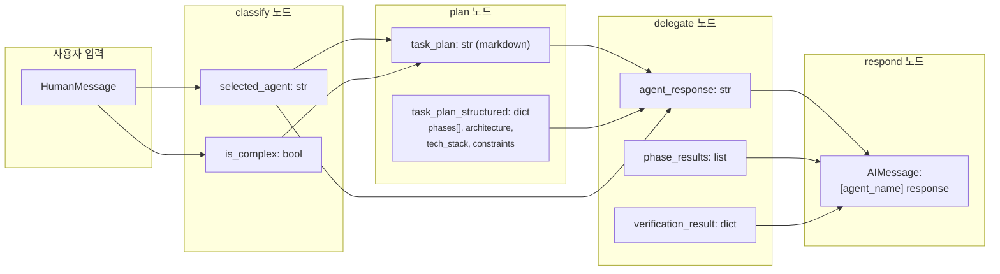
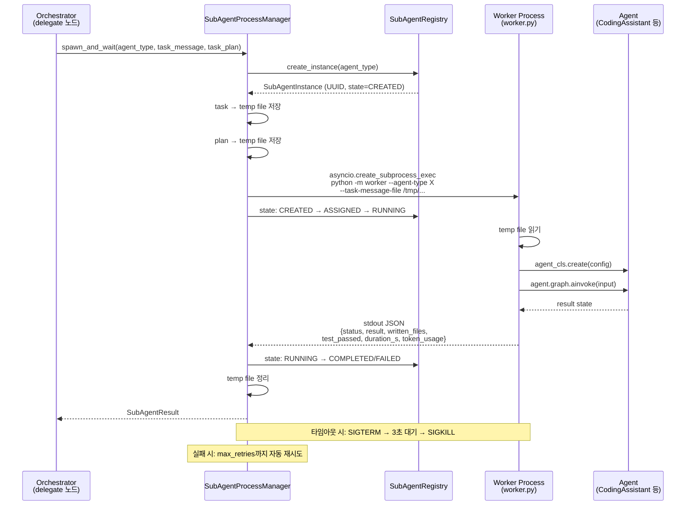
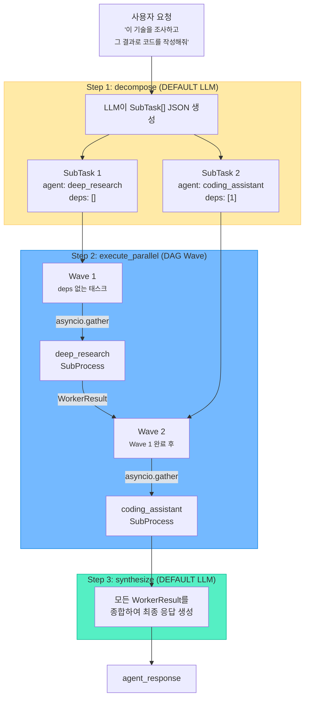
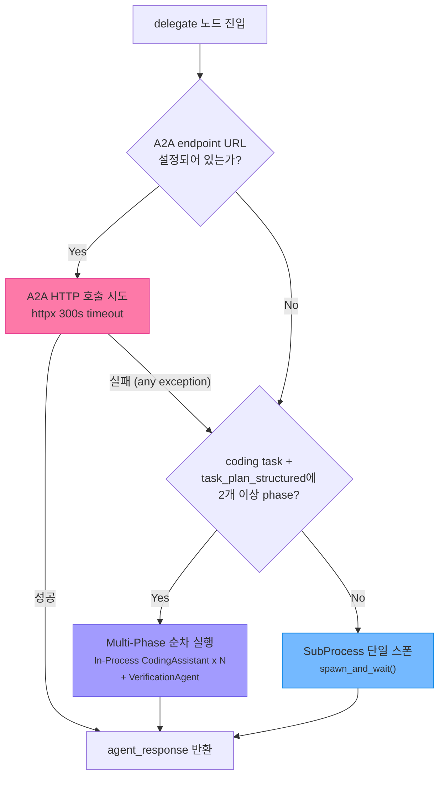
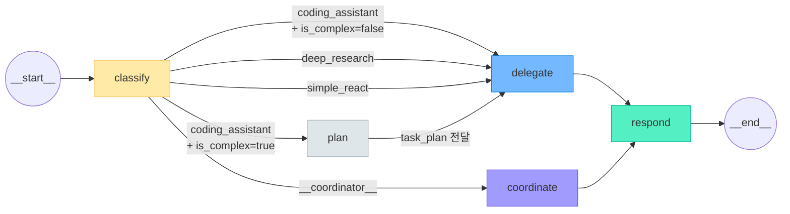
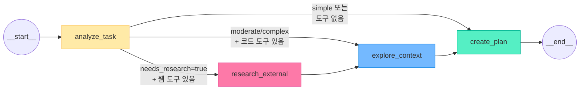
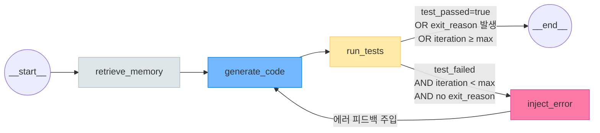
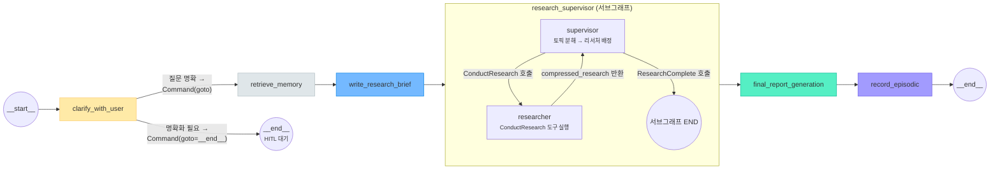
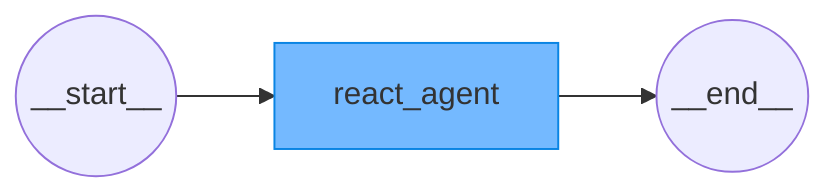

# LangGraph 구성도

AI Coding Agent Harness를 구성하는 5개 에이전트의 LangGraph StateGraph 구조와 에이전트 간 연결 아키텍처를 Mermaid 다이어그램으로 정리합니다.

---

## 1. 에이전트 간 연결 아키텍처 (Inter-Agent)

### 1.1 전체 호출 흐름



### 1.2 통신 프로토콜 매트릭스

| 호출자 | 피호출자 | 프로토콜 | 전송 방식 | 데이터 형식 |
|--------|---------|---------|----------|-----------|
| CLI (`_run_agent_turn`) | OrchestratorAgent | LangGraph `astream_events` | In-Process | `OrchestratorState` |
| `plan` 노드 | PlannerAgent | LangGraph `ainvoke` | In-Process | `PlannerState` |
| `delegate` 노드 (A2A) | 원격 에이전트 | A2A SDK / HTTP | `httpx` (300s timeout) | `SendMessageRequest` → text artifacts |
| `delegate` 노드 (로컬) | 코딩/리서치/ReAct | SubProcess | `asyncio.create_subprocess_exec` | stdin: temp file, stdout: JSON |
| `delegate` 노드 (멀티페이즈) | CodingAssistant (x N) | LangGraph `ainvoke` | In-Process | `CodingState` |
| `delegate` 노드 (멀티페이즈) | VerificationAgent | LangGraph `ainvoke` | In-Process | 검증 결과 dict |
| `coordinate` 노드 | 모든 에이전트 | SubProcess (DAG 병렬) | `asyncio.gather` | stdout: JSON |
| SubProcess Worker | 각 에이전트 | LangGraph `ainvoke` | In-Process (자식 프로세스 내) | 에이전트별 State |

### 1.3 데이터 흐름 상세



### 1.4 SubProcess 생명주기



### 1.5 Coordinate (멀티에이전트) 흐름



### 1.6 delegate 노드 — 실행 경로 결정 로직



---

## 2. 에이전트별 설명

### OrchestratorAgent — 중앙 라우터 및 오케스트레이터

시스템의 진입점이자 모든 에이전트 호출을 관장하는 중앙 허브입니다.
사용자의 요청을 FAST 모델로 빠르게 분류한 뒤, 적합한 에이전트에 작업을 위임합니다.

**핵심 역할:**
- 요청 분류 및 에이전트 라우팅 (coding/research/simple/coordinate)
- 복잡 태스크 감지 시 PlannerAgent로 계획 수립 선행
- A2A → SubProcess → In-Process 3단계 폴백 실행 전략
- 멀티페이즈 순차 실행 및 최종 검증 (VerificationAgent)
- DAG 기반 멀티에이전트 병렬 조율 (coordinate 모드)
- Human-in-the-loop 계획 승인 (`interrupt()`)

**다른 에이전트와의 관계:**
- PlannerAgent를 **In-Process**로 직접 호출 (plan 노드)
- CodingAssistant/DeepResearch/SimpleReAct를 **SubProcess** 또는 **A2A HTTP**로 호출 (delegate 노드)
- 멀티페이즈 코딩 시 CodingAssistant를 **In-Process 반복 호출** + VerificationAgent로 검증

---

### PlannerAgent — 구현 계획 설계자

복잡한 코딩 태스크를 실행 가능한 단계별 계획으로 분해합니다.
OrchestratorAgent의 `plan` 노드에서만 호출되며, 항상 In-Process로 실행됩니다.

**핵심 역할:**
- REASONING 모델로 태스크 복잡도 분석 (simple/moderate/complex)
- 필요 시 웹 검색(Tavily/Arxiv)으로 외부 지식 수집
- MCP 도구로 기존 프로젝트 구조 탐색
- 페이즈별 파일 목록, 아키텍처, 기술 스택을 포함한 구조화된 `TaskPlan` 생성
- 페이즈당 8파일 제한 → 초과 시 자동 분할

**다른 에이전트와의 관계:**
- OrchestratorAgent에 의해서만 호출됨 (1:1 종속)
- 생성한 `task_plan`이 CodingAssistantAgent에 전달되어 실행의 기반이 됨

---

### CodingAssistantAgent — 코드 생성 및 검증 실행자

실제 코드를 작성하고 테스트하는 핵심 에이전트입니다.
단일 태스크는 SubProcess로, 멀티페이즈 태스크는 In-Process로 페이즈별 순차 호출됩니다.

**핵심 역할:**
- 6종 장기 메모리를 참조하여 컨텍스트 인지 코드 생성
- STRONG 모델 + MCP 도구(read/write/shell/search)로 ReAct 루프 실행
- 테스트 실행 → 실패 시 에러 피드백 주입 → 재생성 (최대 N회 반복)
- StallDetector, TurnBudget, AbortController로 무한 루프 방지
- Procedural Memory에 실패 패턴 누적 (Voyager 패턴)

**다른 에이전트와의 관계:**
- OrchestratorAgent의 `delegate` 노드에서 SubProcess 또는 In-Process로 호출됨
- PlannerAgent의 `task_plan`을 입력으로 받아 실행
- `coordinate` 모드에서 다른 에이전트와 병렬 실행 가능

---

### DeepResearchAgent — 심층 리서치 수행자

웹 검색과 학술 자료 탐색을 통해 심층 리서치 보고서를 생성합니다.

**핵심 역할:**
- 모호한 질문에 대해 HITL 명확화 요청 (LangGraph `Command` 라우팅)
- Semantic + Episodic 메모리로 과거 유사 리서치 참조
- Supervisor-Researcher 서브그래프로 토픽별 병렬 리서치
- 리서치 결과를 종합한 최종 보고서 생성
- 완료된 리서치를 Episodic Memory에 저장 (미래 재활용)

**다른 에이전트와의 관계:**
- OrchestratorAgent의 `delegate` 노드에서 SubProcess로 호출됨
- `coordinate` 모드에서 CodingAssistant와 순차 연계 가능 (리서치 → 코딩)

---

### SimpleReActAgent — 경량 도구 실행자

단순 질의나 파일 조회 등 가벼운 작업을 처리하는 최소 에이전트입니다.

**핵심 역할:**
- LangChain `create_agent` 기반 단일 노드 ReAct 루프
- 모든 MCP 도구 바인딩 (read/write/shell/search)
- 별도 메모리·계획·검증 없이 즉시 실행

**다른 에이전트와의 관계:**
- OrchestratorAgent의 `delegate` 노드에서 SubProcess로 호출됨
- 다른 에이전트에 의존하지 않는 독립 실행

---

## 3. 에이전트 내부 LangGraph 구성도 (Intra-Agent)

### 3.1 OrchestratorAgent



### 노드 상세

| 노드 | 모델 티어 | 역할 |
|------|----------|------|
| `classify` | FAST | 사용자 메시지를 읽고 적합한 에이전트 선택 + 복잡도(`is_complex`) 판단 |
| `plan` | _(PlannerAgent 호출)_ | 복잡 태스크 시 PlannerAgent로 구현 계획 수립, `interrupt()`로 사용자 승인 (최대 3회 replan) |
| `delegate` | - | A2A HTTP → fallback으로 SubProcess 스폰. `task_plan`이 있으면 함께 전달 |
| `coordinate` | - | 멀티에이전트 태스크를 DAG로 분해 → 워커 병렬 실행 → 결과 합성 |
| `respond` | - | `agent_response`를 `[에이전트명]` 접두사 AIMessage로 포맷 |

### 조건부 라우팅 (`_route_after_classify`)

```python
if selected == "coding_assistant" and is_complex:
    return "plan"
elif selected == "__coordinator__":
    return "coordinate"
else:
    return "delegate"
```

---

### 3.2 PlannerAgent



### 노드 상세

| 노드 | 모델 티어 | 역할 |
|------|----------|------|
| `analyze_task` | REASONING | 복잡도(simple/moderate/complex), 리서치 필요 여부, 검색 쿼리 판단 |
| `research_external` | STRONG | Tavily/Arxiv MCP 도구로 최대 2라운드 웹 검색 (follow-up 포함) |
| `explore_context` | STRONG | read_file, list_directory, search_code로 로컬 프로젝트 탐색 (최대 5회 도구 호출) |
| `create_plan` | REASONING | 모든 컨텍스트를 종합하여 `TaskPlan` JSON + Markdown 생성. 페이즈당 최대 8파일 제한, 초과 시 자동 분할 |

### 조건부 라우팅 (`_route_after_analyze`)

```python
if needs_research and web_tools_available:
    return "research_external"
elif complexity in ["moderate", "complex"] and code_tools_available:
    return "explore_context"
else:
    return "create_plan"
```

---

### 3.3 CodingAssistantAgent



### 노드 상세

| 노드 | 모델 티어 | 역할 |
|------|----------|------|
| `retrieve_memory` | - | MemoryStore에서 6종 메모리 조회 (Semantic, Episodic, Procedural, UserProfile, DomainKnowledge, Skills) |
| `generate_code` | STRONG | write_file 도구 루프 — 시스템 프롬프트에 메모리 주입, MCP 도구(read/write/validate) 바인딩, StallDetector + TurnBudget 안전장치 + 마크다운 폴백 + 정적 검증 |
| `run_tests` | - | 의존성 설치 + pytest/node 실행 + HTML 검증. planned vs written 파일 검증 |
| `inject_error` | - | traceback에서 관련 파일 내용 추출 → 에러 원문 + 파일 내용을 HumanMessage로 주입. Harness는 기계적 수집만, 판단은 LLM에 위임 |

### 재시도 루프

`generate_code → run_tests → inject_error → generate_code` (최대 `max_iterations`회)

### 조건부 라우팅 (`_should_retry_tests`)

```python
if test_passed or exit_reason or iteration >= max_iterations:
    return END
else:
    return "inject_error"
```

### 미들웨어 체인 (Onion 패턴, 바깥→안쪽)

```
ResilienceMiddleware → SummarizationMiddleware (110K, LLM 요약) → MessageWindowMiddleware (100K, 규칙 기반 안전망) → MemoryMiddleware → LLM
```

#### 미들웨어 상세

| 미들웨어 | 트리거 | 동작 | 모델 |
|---------|--------|------|------|
| **ResilienceMiddleware** | 항상 | 재시도/타임아웃/AbortController | - |
| **SummarizationMiddleware** | 110K 토큰 초과 | DEFAULT LLM으로 이전 대화를 요약 — 중복/반복 제거, 핵심 정보(변수명, import, 에러) 모두 보존 | DEFAULT (qwen-plus) |
| **MessageWindowMiddleware** | 100K 토큰 초과 | 3단계 규칙 기반 컴팩션: ①마이크로(오래된 도구 결과 cleared) ②윈도우(첫 메시지+에러 우선+최근 8개) ③긴급(FIFO 역순) | - |
| **MemoryMiddleware** | 항상 | CoALA 메모리 컨텍스트 주입 | - |

**설계 원칙** (Claude Code / Codex / DeepAgents 분석 반영):
- 토큰 기반 트리거 (메시지 수가 아님)
- LLM 요약이 규칙 기반보다 먼저 실행 (Summarization → MessageWindow 순서)
- 에러 메시지 우선 보존 — 재시도 루프에서 에러 컨텍스트가 잘리지 않음
- 128K 모델 컨텍스트를 충분히 활용 (출력 ~16K 확보, 입력 ~110K)

---

### 3.4 DeepResearchAgent



### 노드 상세

| 노드 | 모델 티어 | 역할 |
|------|----------|------|
| `clarify_with_user` | STRONG | 질문이 모호하면 `Command(goto="__end__")`로 HITL 대기. 명확하면 `Command(goto="retrieve_memory")` |
| `retrieve_memory` | - | Semantic(프로젝트 규칙) + Episodic(과거 유사 리서치 top-3) 메모리 조회 |
| `write_research_brief` | STRONG | 사용자 메시지를 구체적 연구 질문으로 정제 |
| `research_supervisor` | STRONG | 서브그래프 — 토픽 분해 → 병렬 리서처 배정 → 압축 노트 수집 → `ResearchComplete` 시 종료 |
| `final_report_generation` | STRONG | 모든 notes/raw_notes를 종합하여 최종 보고서 작성 |
| `record_episodic` | - | 연구 요약을 Episodic Memory에 저장 (향후 유사 질문에 재활용) |

### 라우팅 방식

`clarify_with_user`는 `add_conditional_edges`가 아닌 LangGraph `Command` 객체를 반환하여 동적 라우팅합니다.

---

### 3.5 SimpleReActAgent



### 노드 상세

| 노드 | 모델 티어 | 역할 |
|------|----------|------|
| `react_agent` | DEFAULT | LangChain `create_agent` — 내장 ReAct 루프 (LLM → 도구 → 결과 → LLM → ...) 단일 노드. MCP 도구 전체 바인딩 |

---

## 4. 요약 테이블

| Agent | 노드 수 | 조건부 분기 | 재시도 루프 | HITL |
|-------|--------|-----------|-----------|------|
| OrchestratorAgent | 5 | classify → {plan, delegate, coordinate} | - | plan 노드 (승인) |
| PlannerAgent | 4 | analyze_task → {research, explore, create_plan} | - | - |
| CodingAssistantAgent | 4 | run_tests → {END, inject_error} | generate→test→inject→generate | - |
| DeepResearchAgent | 6 | clarify → {retrieve_memory, \_\_end\_\_} | supervisor 내부 루프 | clarify (명확화) |
| SimpleReActAgent | 1 | - | 내부 ReAct 루프 | - |
